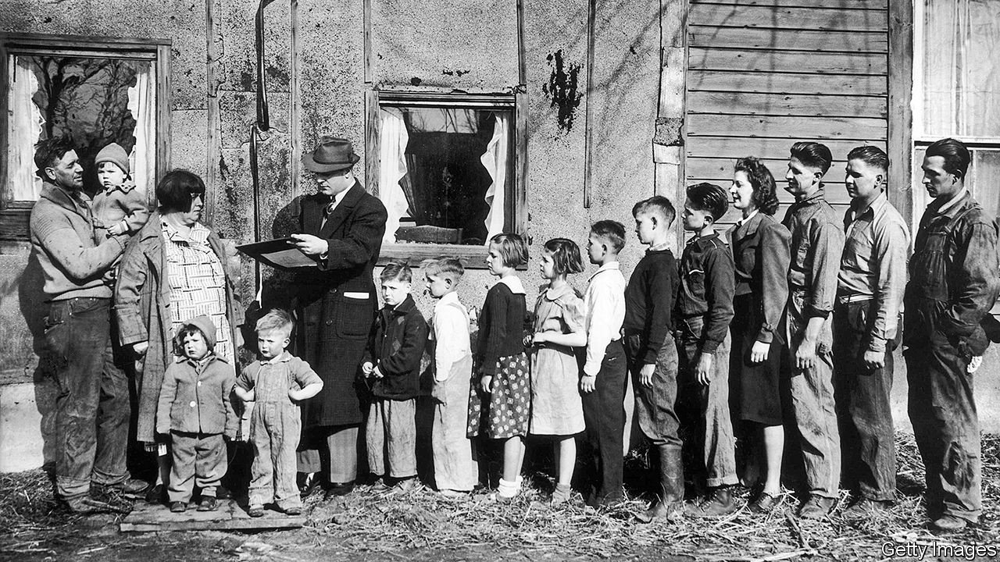
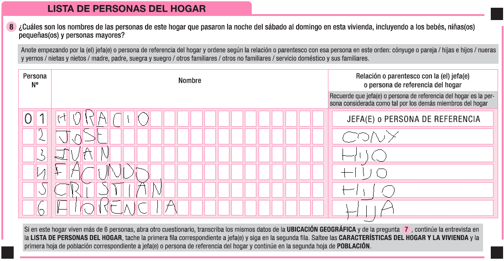

# R Base{#intro}

```{r include=FALSE}
knitr::opts_chunk$set(echo = TRUE, warning = F)
library(knitr)
library(fontawesome)
library(tidyverse)
Sys.setlocale("LC_ALL", "Spanish_Spain.UTF-8")
```

\usepackage{color}
\usepackage{framed}
\setlength{\fboxsep}{.8em}

\newenvironment{blackbox}{
  \definecolor{shadecolor}{rgb}{0, 0, 0}  % black
  \color{white}
  \begin{shaded}}
 {\end{shaded}}
 
## El proyecto Taller

Un **proyecto** es el marco en el cual realizás tu investigación o trabajo. Contiene los insumos, procesos y resultados. Empecemos por crear uno desde el menú: *File/New Project*, seleccionando el directorio de trabajo. Allí encontrarás un archivo con extensión **R.proj**. Creemos la carpeta de esta unidad, y también un script (*File/New File/R Script*) de extensión *".R"*, que llamemos *Unidad1.R*, en el que seguiremos los contenidos y resolveremos los ejercicios.

Para conocer "donde estamos parados", nuestro directorio de trabajo (*working directory*) se encuentra por default en la carpeta del proyecto:

```{r, eval=F}
getwd()
```

### Variables

Para adentrarnos en las características de **R**, censaremos un **hogar**. Pero... ¿qué es un hogar? Es una unidad de análisis demográfica, definida en un marco operativo censal: *"se entiende por hogar una persona que vive sola o un grupo de personas que pueden o no estar emparentadas pero que comparten el presupuesto para los gastos de alimentación" (ONU, 2011)* (ojo, no confundir con _vivienda_ y/o *familia*).

Resulta que nos fue asignada determinada vivienda, con un solo hogar. Al llegar a la cuadra vemos lo siguiente... 

```{r, echo=F, fig.cap="Fuente: https://www.economist.com/books-and-arts/2020/04/16/a-lively-and-enlightening-history-of-the-census"}

```

Por suerte nos fue asignada la siguiente vivienda. Son 6 miembros. ¿Cómo se listan los miembros de un hogar en un formulario censal?

```{r, echo=F, fig.cap="fuente: en base a https://www.indec.gob.ar/indec/web/Nivel3-Tema-2-41"}

```

Una vez completado el formulario *persona* para cada miembro, nos retiramos `r fa("running")` dando las gracias y nos sentamos a inspeccionar las características del hogar en *R*. Para esto empezaremos con los atributos del jefe o persona de referencia: Horacio `r fa("house-user")`.


La asignación de variables (y de todo tipo de objeto) se realiza mediante el operador `r fa("arrow-left")` (veáse la direccionalidad **objeto** `r fa("arrow-left")` **valor**).

```{r}
edad <- 63
```

Es recomendable no nombrar objetos con números al inicio, y sin incluir coma u otros caracteres especiales. También pueden encontrar el uso de __=__ para asignar. ¿Qué usar? 

Para ver el contenido del objeto creado, podemos ejecutar su nombre en la consola, o desde el script pintando el objeto y presionando el botón *Run* (o *ctrl+enter*):

```{r}
edad 
```

Las operaciones lógicas estan por detrás de la mayoría de los procesos que realizaremos en el taller. ¿Es de **equivalencia** la siguiente relación? 

```{r}
edad == 50 
```

¿Es **menor** que...?  

```{r}
edad < 40 
```

Otras operaciones lógicas son: **>**, **<=**, **>=**, **!=** (distinto), etc. (luego veremos algunas más).  
Las operaciones sin asignación no cambian el valor de la variable creada:

```{r}
edad + 10
```

¡Atención! lenguaje sensible a mayúsculas:

```{r}
Edad <- 45
Edad != edad
```

Los tipos de variable más relevantes son:  

* **numeric** (decimales con ".")
```{r}
edad_exacta <- 63.72
edad == trunc(edad_exacta)
```
* **character** (string)  
```{r}
nombre <- "Horacio"

# Qué clase de objeto es? (esto es un comentario en R)
class(nombre)
```
* **logic** (verdadero/falso)  
```{r}
autoRespondente <- TRUE
autoRespondente == FALSE
```
* **date** (fecha)

```{r}
f_nacim <- "1960/01/01"
```

Mmm pero `f_nacim` es *character* (`class(f_nacim)`), por lo que deberíamos transformarlo. La función base para cambio de *tipos* comienza con *as*. Utilicemos el predictor de comando, a ver qué nos sugiere... (presiona *"as."* para ver la lista desplegable de sugerencias). En este caso:

```{r}
f_nacim <- as.Date(f_nacim)
```

::: {.take_note_box  .take_note data-latex="{take_note}"}
Fechas: si quisiéramos interpretar una fecha con el formato que utilizamos en Argentina, tendríamos que especificarlo:<br>
`f_nacim <- as.Date("01/01/1960", format = "%d/%m/%Y")`.<br>Por suerte hay paquetes  como `lubridate` que nos harán las cosas más fáciles. Lo veremos en unidades siguientes.
:::

La ausencia de valor se representa con **NA** (missing/vacío):
```{r}
sexo <- NA 
#un operador lógico  importante es preguntar si un objeto es vacío:
is.na(sexo)
```

Tu yo del futuro, otros humanos y múltiples computadoras leerán tu código: hablemos de algunas buenas practicas (aquí [algunas](HUmanos y robots)).

### Actividad

El hogar que te fue asignado tambien tiene un jefe/a o persona de referencia. Te proponemos lo siguiente:

a) Crear los atributos `nombre`, `sexo`, `edad`, `f_nacim`.

```{r, include=F, eval=F}
nombre <- "Horacio"
sexo <- "Varón"
edad <- 63
f_nacim <- as.Date("1960/01/01")
```

a) El censo lo respondió otra persona. Asigna un valor a `autoRespondente`.

```{r, include=F, eval=F}
autoRespondente <- FALSE
```

a) Crear la variable `edad_en_10_años` que tenga la edad cumplida en 10 años. Corroborar que no son equivalentes.

```{r, include=F, eval=F}
edad_en_10_años <- edad + 10
edad_en_10_años == edad
```
a) Obtener la diferencia entre ambas edades: `edad_en_10_años - edad_hoy`.

```{r, include=F, eval=F}
edad_en_10_años - edad
```

***

## Vectores

Es la estructura de datos más simple en R. Un vector es un arreglo de elementos del mismo tipo (*podes comprobarlo*). Inicializamos un vector **c**ombinando elementos mediante **c(...)**. Por ejemplo `c(1,2,3)`. Las variables son vectores de 1 elemento.

Creemos los vectores de atributos de los miembros del hogar censado, cuyo **orden** refiere a cada unidad de análisis **persona**:

```{r}
nombre_jefe     <- "Horacio"
nombre_conyuge  <- "José"
nombre_hijos    <- c("Iván", "Facundo", "Cristian", "Florencia")
nombre          <- c(nombre_jefe, nombre_conyuge, nombre_hijos) # unión de vectores mediante c(), los "apilo"
edad            <- c(63, 60, 35, 32, 27, 27)
f_nacim         <- as.Date(c("1960/01/01", "1961/11/05", "1985/11/08", "1987/01/21", "1993/10/23", "1993/10/24"))
sexo            <- c("v", "m", "v", NA, "v", "m")
autoRespondente <- c(T, rep(F, 5)) # repetí un valor 5 veces

# ¿Acabo de "pisar" objetos? ¿Qué significa? 
```

¿Qué tipo de objetos son? ¿Qué información contienen? Algunas funciones útiles de exploración...

```{r}
class(f_nacim)          # tipo de objeto
length(autoRespondente) # cantidad de elementos de un vector
str(nombre)               # estructura
summary(edad)           # resumen de elementos
unique(sexo)            # valores únicos
```

¿Cómo extraer información de un vector? con **[...]**. Por ejemplo, el nombre de la cuarta persona listada en mi hogar.

```{r}
nombre[4]
```

¿Y de los tres últimos? Incluyo como referencia el vector de posiciones `c(4,5,6)`.

```{r}
nombre[c(4,5,6)] 
nombre[4:6] # equivalente
```

Un aspecto muuuy útil de R: vectorizar operaciones. Por default aplica la operación a cada uno de los elementos de un vector, sin necesidad de *loopear* a lo largo del mismo. Veamos qué pasa con los operadores lógicos que vimos en las variables:

```{r}
nombre == "Facundo"
```
¿Qué personas tienen una edad menor a 33?

```{r}
edad < 33
```

¡Pero decime los nombres che!

```{r}
nombre[edad < 33]
```

Podemos comparar internamente elementos de un vector. ¿Qué estamos preguntando aquí?

```{r}
f_nacim[1] < f_nacim 
```

::: {.take_note_box  .take_note data-latex="{take_note}"}
Más sobre extracción de elementos de un vector: <br>
¿En qué orden fui listado yo?: `which(nombre=="Iván")`<br>
¿Quiénes me caen bien? Puedo usar un operador lógico para excluir una posición (y dejar el resto).
Todos menos Cristian:<br>
`nombre[nombre!="Cristian"]`<br>
Otra forma de verlo, en dos pasos:<br>
`posicion_de_Cristian <-  which(nombre=="Cristian")`<br> `nombre[-posicion_de_Cristian]`
:::

Medidas resúmen útiles sobre vectores numéricos:
```{r}
mean(edad)
min(f_nacim)
range(edad)
```

Antes de continuar: si queremos reemplazar por ejemplo `f_nacim` por `fecha_nacim`, podemos utilizar lo que nos ofrece *RStudio* para buscar y reemplazar (con *CRTL+f* ) recreando el objeto desde el inicio, o crear un vector idéntico (y eliminar el anterior).

```{r}
fecha_nacim <- f_nacim
# remover (bienvenido si no quieres ir dejando basura pesada por allí)
rm(f_nacim) 
```


::: {.take_note_box  .take_note data-latex="{take_note}"}
Ayuda!!!
Se puede pedir ayuda consultando la documentación de las funciones:`?range` o `help(range)`. Y muy probablmente alguien ya se topó con tu problema:<br>

:::

### Actividad

Considerando el hogar de Horacio, responder:

a) ¿Qué valores únicos tiene la variable `autoRespondente`?
```{r, include=F}
unique(autoRespondente)
```
a) ¿Cuales son los nombres de las personas que censé con una edad mayor a 50? 

```{r, include=F}
nombre[edad>50]
```
a) ¿En qué fecha nació Florencia?

```{r, include=F}
fecha_nacim[nombre=="Florencia"]
```


a) Toma 4 personas que conozcas e incorpóralos como miembros de tu hogar: crear los vectores de atributos `nombre`, `sexo` , `edad` y `fecha de nacimiento` de los miembros del hogar del grupo. Tener en cuenta el **orden** `r fa("exclamation")`. 

```{r, include=F}

```

a) ¿Cómo se llama la segunda persona listada? Obtener el nombre utilizando corchetes `[]`.
```{r, include=F}
nombre[2]
```

a) Obtener el rango de la edad de los miembros del hogar y su promedio. Para lo primero se puede usar `min` y `max` o directamente la función `range`.
```{r, include=F}
range(edad)
```

a) Mediante `Sys.Date()` se puede ontener la fecha de hoy (guardarla en una variable si es preferible). Calcular la edad exacta de los miembros, al día de la fecha, de la siguiente manera: `(fecha_hoy - fecha_nacim)/365` (restamos fechas y las convertimos en años de manera aproximada). 
```{r, include=F}
fecha_hoy <- Sys.Date()
edad_exacta <- (fecha_hoy - fecha_nacim)/365
```

a) ¿Y la edad *cumplida* de los miembros cuál es? ¿El respondente informó correctamente la edad de todos los miembros?
```{r, include=F}
edad_cumplida <- trunc(edad_exacta)
edad_cumplida == edad
```

a) Con la función `nchar()` podés obtener el largo de un texto. ¿Cuál es el nombre más largo?
```{r, include=F}
nombre[nchar(nombre)==max(nchar(nombre))]
```
***

## Data.frames

El objeto más flexible en R es el **data.frame**: permite combinar múltiples variables de distintas clases, símil a las tablas que tratamos en otros softwares estadísticos o excel. Organicemos los atributos de los miembros de mi hogar en un **data.frame**:

```{r}
hogar <- data.frame(nombre, sexo, edad, fecha_nacim, autoRespondente, stringsAsFactors = F) 
hogar
```

¿Características?

```{r}
class(hogar)     # clase de objeto
str(hogar)       # estructura
summary(hogar)   # resumen
colnames(hogar)  # nombres de columnas
ncol(hogar)      # número de columnas
nrow(hogar)      # número de filas
```

Para *verlo* tipo excel puedes usar `View(hogar)` o directamente desde el tab `Environment` haciendo click en el objeto. La selección de variables en un *data.frame* puede realizarse de distintas maneras. Por ejemplo para la variable *sexo*:

```{r}
# con "$": al tipear el signo te sugiere las variables que contiene
hogar$sexo 

# Una vez dentro del vector, vale lo que vimos en la sección previa de vectores. ¿Cuál es el miembro con sexo sin valor?
hogar$nombre[is.na(hogar$sexo)]
```

También podemos seleccionar datos mediante coordendas del tipo **[fila, columna]**, o condicionado a la variable elegida.

```{r}
hogar[2,3]    # fila 2, columna 3
hogar$edad[2] # en la variable edad, seleccionar el segundo elemento
hogar[2,]     # ¿Y esto?
hogar[,2]     # ¿Y esto cuando lo vimos?
```

Al crear el *data.frame* forzamos la no existencia de variables de tipo **factor** (` stringsAsFactors = F`). Los tipos de variable *factor* son variables categóricas (nominales u ordinales), con niveles (o códigos) y etiquetas (al estilo SPSS). Son muy relevantes para algunos paquetes que veremos más adelante, como *ggplot2*, para dar jerarquía al orden de visualización de las series. Por ejemplo, podemos **crear** la variable relación de parentezco *rp* respecto al jefe del hogar o persona de referencia.

```{r}
hogar$rp <- factor(c("jefe", "cónyuge", "hije", "hije", "hije", "hije"))

# característica
class(hogar$rp)
str(hogar$rp) # para R siempre la variable será esencialmente un entero
levels(hogar$rp)
nlevels(hogar$rp)
```

Al parecer el respondente fue el cónyuge. Hagamos el cambio seleccionando de la variable `autoRespondete` aquellla observación (persona) que sea:

```{r}
hogar$autoRespondente[hogar$rp == "jefe"]    <- FALSE  # ¿Cómo se lee esto?
hogar$autoRespondente[hogar$rp == "cónyuge"] <- TRUE
```

### Actividad

a) A partir de los vectores creados en la actividad previa, generar un *data.frame* con los miembros del hogar. 

```{r, include=F, eval=F}
hogar <- data.frame(nombre, sexo, edad, fecha_nacim, autoRespondente, stringsAsFactors = F) 
```

a) Inspeccionar sus características.

```{r, include=F, eval=F}
summary(hogar)
```

a) Obtener todos los datos del segundo miembro listado con el uso de corchetes `[]`.  
```{r, include=F, eval=F}
hogar[2,]
```

a) Luego de una revisita al hogar encontramos que el tercer miembro listado prefiere que no conste su sexo, y que el cuarto miembro pefiere ser listado con su apodo "Pepe". Hacer los cambios correspondientes.
```{r, include=F, eval=F}
hogar$sexo[3] <- NA
hogar$nombre[hogar$nombre=="Florencia"] <- "Pepe"
```

a) Agregar una variable con el número de caracteres de cada nombre. Informar el promedio.
```{r, include=F, eval=F}
hogar$n_caracteres <- nchar(hogar$nombre)
mean(hogar$n_caracteres)
```

***

## Listas

¿Te preguntarás si hay vida más allá del **data.frame**? Por supuesto, las **listas**. Una lista es una colección de objetos de cualquier tipo (incluidos los data.frame). Por ejemplo si el tercer miembro es Iván y se construye en el terreno de los padres y forma su propio hogar dentro de la vivienda, el **listado de hogares** censado tendría dos data.frame:

```{r}
hogar_1 <- hogar[-3,] 
hogar_2 <- hogar[3,]
lista_de_hogares <- list(hogar_1 = hogar_1, 
                         hogar_2 = hogar_2)

# inspecciono
str(lista_de_hogares)
```

Para acceder a un elemento de la lista utilizamos doble corchete:

```{r}
# el primer hogar del listado es:
lista_de_hogares[[1]]

# el nombre del miembro 3 del segundo hogar, mi antigua casa, ahora es:
lista_de_hogares[[1]]$nombre[3]

# puedo utilizar también el nombre del objeto dentro de la lista, en vez de su posición:
lista_de_hogares[["hogar_1"]]$nombre[3]

```

Una buena explicación sobre la estructura de selección la dió el mismísimo Hadley Wickham [acá](https://twitter.com/hadleywickham/status/979388069362130944).

Estimados, considerando que no llego a fin de mes, decido incorporarme de nuevo a mi hogar natal, por lo que el hogar número 2 debe ser removido. ¿Cómo incorporo una nueva fila a un *data.frame*? Se puede utilizar `rbind` (`r` de rows, que tiene su primo `cbind` para unir columnas, con `c` de columns).

```{r}
# junto los hogares
hogar_reunificado <- rbind(hogar_1, hogar_2)

# lo asigno de vuelta al hogar_natal original
lista_de_hogares[["hogar_1"]] <- hogar_reunificado

# borro de la lista el hogar independiente
lista_de_hogares$hogar_2 <- NULL
```

Y debo tener el mismo hogar que antes, pero ahora como elemento de un listado:

```{r}
str(lista_de_hogares)
```

### Actividad

a) Antes que cierres la puerta, el respondente te avisa que se alquila una pieza al fondo del terreno, donde vive Luis: varón, nacido el 3 de junio del 2000, en su hogar unipersonal. Incorporalo a la lista de hogares de al vivienda.

```{r}
hogar_luis <- data.frame(nombre = "Luis", sexo = "v", edad = 23, fecha_nacim = "2000-06-03", autoRespondente = TRUE, rp = "jefe")
```

```{r, eval = F, include= F}
lista_de_hogares <- list(hogar_1 = hogar, 
                         hogar_2 = hogar_luis)

# inspecciono
str(lista_de_hogares)
```

a) Al querer irte Luis te avisa que en verdad el colabora monetariamente con la comida diaria, y hasta cenan juntos por las noches. Probablemente sea mejor unificar todo en un solo hogar. Hazlo recordando eliminar el hogar unipersonal de Luis asignando *NULL* a ese elemento de la lista, o en todo caso creando un nuevo objeto `lista_de_hogares` sin un segundo elemento (*pisarlo*).

```{r}
lista_de_hogares <- list(hogar_1 = rbind(hogar, hogar_luis))
```

***

## Referencias y materiales adicionales  

- [Hoja de ayuda](https://raw.githubusercontent.com/rstudio/cheatsheets/main/translations/spanish/base-r_es.pdf)  

- [Libros en español](https://statsanddatasci.netlify.com/post/libros-en-espa%C3%B1ol/)  
