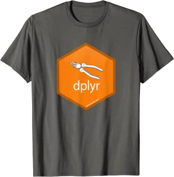
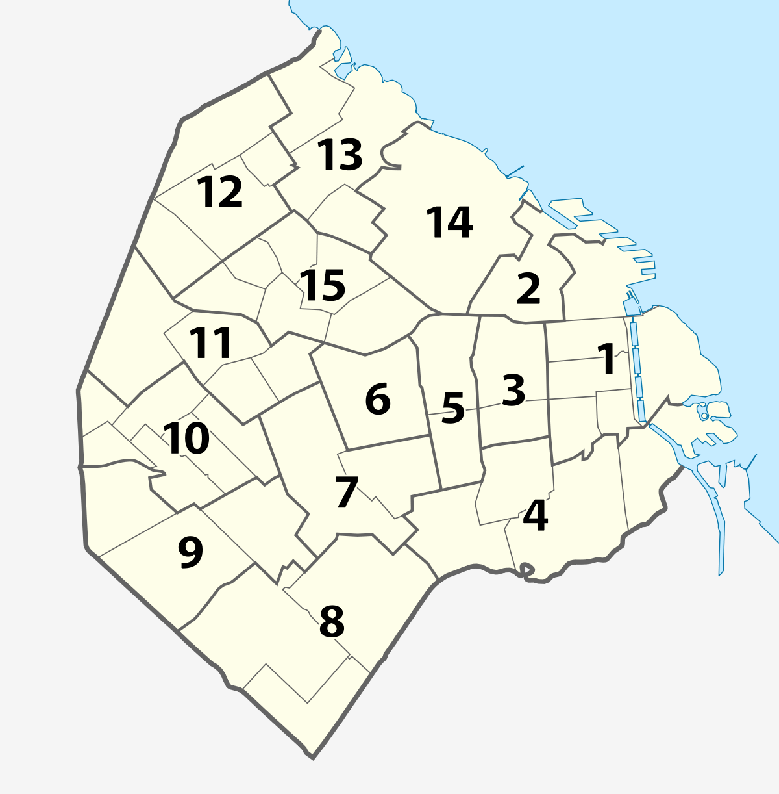

# dplyr

```{r setup, include=FALSE}
knitr::opts_chunk$set(echo = TRUE, results = "hide", message=FALSE)
library(fontawesome)
library(knitr)
library(googledrive)
caba2010_br <- read.csv("Data/C2010_CABA.csv", header = T, sep=",")
```

En la unidad previa caracterizamos un hogar censal. En esta unidad trabajaremos la base de datos censal, con todas sus viviendas, hogares y personas. Para esto recorreremos algunos paquetes de [tidyverse](https://www.tidyverse.org/), cuyo fin es generar un entorno integrado de herramientas de análisis de datos.

```{r, message=F, warning=F}
# install.packages("tidyverse")
library("tidyverse")
```

El paquete [*dplyr*](https://dplyr.tidyverse.org/) contiene las operaciones más comunes sobre una tabla de datos, y se volvió en los útlimos años el paquete más utilizado para este fin. 

{width=250px}

Una de sus ventajas es el uso del pipe `%>%`,  que concatena operaciones sobre el mismo objeto, *verbalizando* el proceso, generando fluidez en nuestro razonamiento y mejor entendimiento para un tercero. En vez de `f(x)` (aplicar una función `f()` a un objeto `x`) se tiene `x %>% f()` (tengo un objeto `x` y le aplico la función `f()`):

```{r}
1:10 %>% mean()
```

Previo a comenzar debes haber leído *"C2010_CABA.csv"* (con separador ","), haberla inspeccionado brevemente y haberla guardado en un objeto llamado _caba2010_br_ (ver documento "Unidad_2_lectura.html"). 


## seleccionar (**select**), renombrar (**rename**)

Empecemos a trabajar la base de datos censal. Para este ejercicio nos interesa contar con la variable geográfica sobre el departamento de CABA al que pertence la vivienda, las variables de identificación de las unidades de análisis, y algunos atributos en función del [cuestionario](https://www.indec.gob.ar/ftp/cuadros/poblacion/cuestionario_ampliado_2010.pdf). Quedémonos con estas variables mediante la función **select**:

```{r}
caba2010 <- select(caba2010_br, 
                   IDDPTO, VIVIENDA_ID, HOGAR_ID, PERSONA_ID,
                   V01, P01, P02, P03, P05)
```

Podemos realizar la misma operación de la mano de **%>%**, no necesitando especificar el objeto como argumento:

```{r}
caba2010 <- caba2010_br %>% select(IDDPTO, VIVIENDA_ID, V01, HOGAR_ID, 
                                   PERSONA_ID, P01, P02, P03, P05)
# léase: toma el objeto *** y selecciona las columnas ***
```

Si quisiéramos quedarnos solo con las variables de persona podríamos usar `starts_with("P")` dentro de `select` (o también `P01:P05`, ¡probalo!), y muchas más [funcionalidades útiles](https://dplyr.tidyverse.org/reference/select.html) para tablas con muchas columnas. 
Nótese que estamos *pisando* el mismo objeto. Luego podemos renombrar algunas variables para hacer su uso más fluido, mediante **rename**:

```{r}
# NuevoNombre = ViejoNombre
caba2010 <- caba2010 %>% rename(Tipo_Viv = V01, Rel_Par = P01, Sexo = P02, Edad = P03, nativo = P05)
# Tambien por posición
```

Habrás notado una de sus ventajas: la referencia al nombre de las variables no requiere *$* ni *"[,]"* como en R Base. Podemos condensar lo anterior y hacerlo todo en un paso utilizando **%>%**. Implica algo super útil: **un nuevo %>% supone el objeto ya modificado**.

```{r, eval=T}
caba2010 <- caba2010_br %>% 
                rename(Tipo_Viv = V01, Rel_Par = P01, Sexo = P02, Edad = P03, nativo = P05) %>% 
                select(IDDPTO, VIVIENDA_ID, HOGAR_ID, PERSONA_ID, 
                       Tipo_Viv, Rel_Par, Sexo, Edad, nativo)
```

¿Lo que estamos generando es un *data.frame*? ¿Qué es un *tibble*?

#### Actividad

a1. Crear un data.frame llamado "caba2010_a1" que contenga solo las variables identificatorias de "caba2010_br" (que tienen un "ID"). 

a2. Renombrar las variables de manera que siempre comiencen con "ID_".

a3. Contar la cantidad de columnas mediante `ncol()` y corrobar que la cantidad de variables sea menor a las de "caba2010_br".

```{r, include=F, eval=F}
caba2010_a1 <- caba2010_br %>% 
  select(IDDPTO, VIVIENDA_ID, HOGAR_ID, PERSONA_ID) %>% 
  rename(ID_DPTO = IDDPTO, ID_VIVIENDA = VIVIENDA_ID, ID_HOGAR = HOGAR_ID, ID_PERSONA = PERSONA_ID)
ncol(caba2010_a1)
```

***

## resumir (**summarise**) por grupos (**group_by**)

Como analistas nos interesa calcular medidas resumen para poder obtener conclusiones, plantear hipótesis o simplemente conocer más el fenómeno relevado/registrado en los datos. Si quisiéramos saber cuántas personas existen en nuestra base de CABA podemos realizar un **summarise** (resumen) de los datos mediante la función `n()` (contar filas):

```{r}
n_personas <- caba2010 %>% summarise(casos = n()) 
```

Para contar cuántas viviendas fueron relevadas en la base debemos considerar casos con valor *distinto* en la variable de código de vivienda `VIVIENDA_ID`:

```{r}
n_viviendas <- caba2010 %>% summarise(casos = n_distinct(VIVIENDA_ID))
```

¿Cuál es el promedio de personas por vivienda?
```{r, include=F}
n_personas / n_viviendas
```

<!-- box-->
<p class="comment">
<strong>Cóctel propio</strong><br>
¿De qué forma podríamos hacer lo anterior en R *base* (`nrow`, `ncol`, `unique`)? La experiencia de usuario de cada uno define el mix de herramientas que le es más cómodo/útil según la complejidad de cada tarea.  
</p>
<!-- box-->

Con **summarise** podemos aplicar cualquier función resumen sobre los datos. Por ejemplo: ¿Cual es la edad promedio de las personas? ¿Cual es la edad máxima reportada?
```{r, include=F}
caba2010 %>% summarise(edad_media = mean(Edad))
caba2010 %>% summarise(edad_max = max(Edad))
```

¿Podemos incluir todo lo anterior en una sola sentencia? ¡Esa es la magia de **%>%**!
```{r, eval=F}
caba2010 %>% 
  summarise(n_personas = n(), 
            n_viviendas = n_distinct(VIVIENDA_ID), 
            n_hogares = n_distinct(HOGAR_ID), 
            pers_x_viv = n_personas/n_viviendas, 
            pers_x_hog = n_personas/n_hogares, 
            hog_x_viv = n_hogares/n_viviendas,
            edad_media = mean(Edad),
            edad_max = max(Edad)
            )
```

Las operaciones principales que podemos realizar mediante **summarise** las podés ver [acá](https://dplyr.tidyverse.org/reference/summarise.html).Pero su utilidad se potencia cuando queremos resumir una variable *segmentando por grupos*. Esta agrupación antecede a **summarise**, y requiere ser indicada con **group_by**, incluyendo como argumento las variables de agrupación. Por ejemplo, para conocer la cantidad de personas y viviendas relevadas por Departamento (Comuna):

```{r}
pers_viv_dpto <- caba2010 %>% 
                    group_by(IDDPTO) %>% 
                    summarise(n_personas = n(), 
                              n_viviendas = n_distinct(VIVIENDA_ID))
```

Seguro estas cantidades difieren según código de *tipo de vivienda*. Pero primero podemos agregar la variable que describe los códigos. Carguemos como objeto el diccionario e incorporémoslo:

```{r}
cod_tipo_viv <- data.frame(Tipo_Viv = 1:10, 
                           Tipo_Viv_descripc = c("Casa",
                                        "Rancho",
                                        "Casilla",
                                        "Departamento",
                                        "Pieza en inquilinato",
                                        "Pieza en hotel familiar o pensión",
                                        "Local no construido para habitación",
                                        "Vivienda móvil",
                                        "Persona/s viviendo en la calle",
                                        "Sin Dato"))
caba2010 <- caba2010 %>% left_join(cod_tipo_viv, by = "Tipo_Viv")
```

<!-- box-->
<p class="comment">
<strong>Joins!!!</strong><br>
**dplyr** tiene las funciones típicas de *join* para el pareo de data.frames dependiendo la relación que desiemos. Ver más [aquí](https://dplyr.tidyverse.org/reference/mutate-joins.html).<br>
{width=250px}
</p>
<!-- box-->


Ahora sí, obtegamos el promedio de personas por vivienda según tipo:
```{r}
pers_tipoviv_dpto <- caba2010 %>% 
                    group_by(IDDPTO, Tipo_Viv_descripc) %>% 
                    summarise(n_personas = n(), 
                              n_viviendas = n_distinct(VIVIENDA_ID),
                              pers_viv = n_personas/n_viviendas)
```

Es un data.frame grande. A veces queremos *mirar* la tabla: `View(tabla)`

## transformar (**mutate**), filtrar (**filter**), ordenar (**arrange**)

Mediante **mutate** podemos crear variables nuevas que pueden o no relacionarse a las existentes. Tomando la tabla *pers_viv_dpto* (sin distinguir tipo de vivienda), podemos calcular el ratio de personas por vivienda segun departamento `ratioPV`:

```{r, eval=T, results = "hide"}
# a que base nos referimos
head(pers_viv_dpto)

# creo una variable (sin resumir como en summarise)
pers_viv_dpto <- pers_viv_dpto %>% mutate(ratioPV = n_personas / n_viviendas)

# Nos avisan desde INDEC que hay una hipótesis a corroborar de subenumeración de personas del 2% y de viviendas del 1%. Calculemos un indicador alternativo bajo esa hipótesis:
pers_viv_dpto <- pers_viv_dpto %>% mutate(ratioPV_altern = n_personas * 1.02 / n_viviendas * 1.01) 
```

Para conocer qué departamentos poseen mayor promedio, podemos ordernar la tabla mediante **arrange**:

```{r}
pers_viv_dpto <- pers_viv_dpto %>% arrange(ratioPV)

# mejor al revés: descendente
pers_viv_dpto <- pers_viv_dpto %>% arrange(desc(ratioPV))
```

Si solo querés mostrar los tres departamentos con mayor valor, podés utilizar **slice** para seleccionar filas (una vez ordenado):

```{r}
pers_viv_dpto %>% slice(1:3)
```

También puedes filtrar la base a un subconjunto del universo que cumpla determinadas condiciones utilizando **filter**. Por ejemplo, si quisiéramos conocer el indicador solo para las comunas al sur:

{width=250px}

```{r, eval=F}
comunas_al_sur <- c(8,4)
pers_viv_dpto %>% filter(IDDPTO %in% comunas_al_sur) # Operador lógico! (¿te acordás?)
```

Vayamos hacia algo un poquito más complejo. Si quiero obtener la misma tabla anterior pero solo para viviendas que sean *casas, casillas, ranchos o departamentos* (códigos 1 a 4, viviendas individuales más frecuentes), y que no sean hogares *no unipersonales*. 

Comencemos por crear el data.frame con ese listado:

```{r}
# busco un listado de hogares que cumplan ambas condiciones:
hogares_NoUnipersonales <- caba2010 %>%
                          filter(Tipo_Viv<5) %>%
                          group_by(HOGAR_ID) %>% 
                          summarise(n_personas = n()) %>% 
                          filter(n_personas>1) %>% 
                          select(HOGAR_ID)
# incluimos las tres unidades de análisis en una sentencia
```

Ahora calculemos el indicador *filtrando* aquellos hogares obtenidos anteriormente. ¿Los resultados son razonables?

```{r}
PersVivNoUnip_Dpto <- caba2010 %>%
                      filter(HOGAR_ID %in% hogares_NoUnipersonales$HOGAR_ID) %>%  
                      group_by(IDDPTO) %>% 
                      summarise(ratioPV = n() / n_distinct(VIVIENDA_ID)) %>% 
                      arrange(desc(ratioPV)) %>% 
                      slice(1:3)
```

>Si tuviéramos que relatar lo que estamos haciendo, sería algo del tipo: "toma CABA2010, filtralo, agrupalo y calcula por cada grupo el indicador (creando la variable); finalmente selecciona qué quieres mostrar". Es una *¡composición de funciones!*.

Otra operación común es la de calcular distribuciones en una variable, segmentando con determinada agrupación. Podemos ver el porcentaje de mujeres dentro de cada departamento. Considerar que cualquier operación resumen (media, suma, contar) en un data.frame agrupado resumirá por grupos. Aprovechemos eso:

```{r, eval=T}
Porc_mujeres <- caba2010 %>% 
                  group_by(IDDPTO, Sexo) %>% 
                  summarise(N = n()) %>% 
                  mutate(porcM = N/sum(N) * 100) %>%  # sum() es por grupos tambien!
                  filter(Sexo == "MUJER") %>% 
                  select(IDDPTO, porcM)
```

En el caso de que querramos la distribución por grandes grupos de edad, podemos *recodificar* la edad con la función `case_when` en una nueva variable.

```{r, eval=T}
distr_edadGG <- caba2010 %>% 
                  mutate(Edad_GG = case_when(
                                      Edad < 15 ~ "0-14", 
                                      Edad >= 15 & Edad < 65 ~ "15-64", 
                                      TRUE ~ "65+")) %>% 
                  group_by(IDDPTO, Edad_GG) %>% 
                  summarise(N = n()) %>% 
                  mutate(GG = N/sum(N)*100) %>% 
                  select(IDDPTO, Edad_GG, GG)
```

Otras opciones de recodificación son [ifelse](https://www.rdocumentation.org/packages/base/versions/3.6.2/topics/ifelse) la opción base de R y [recode](https://dplyr.tidyverse.org/reference/recode.html).

#### Actividad

b1. Crea un nuevo objeto con el nombre que desees a partir de *CABA2010_br* seleccionando y renombrando solo variables relacionadas a atributos de personas (a tu gusto el nuevo nombre).

```{r,include=F, hide = T}
caba <- caba2010_br %>% 
                rename(Tipo_Viv = V01, Rel_Par = P01, Sexo = P02, Edad = P03, nativo = P05) %>% 
                select(IDDPTO, VIVIENDA_ID, HOGAR_ID, PERSONA_ID, 
                       Tipo_Viv, Rel_Par, Sexo, Edad, nativo)
```

b2. Ordénala de la siguiente manera: ascendente ID de departamento y decreciente en la edad. 

```{r,include=F, hide = T}
caba <- caba %>% arrange(IDDPTO, desc(Edad))
```

b3. El hogar identificado como 705 no debería ser incluido en la base. Removerlo utilizando *filter*.
```{r, include=F, hide = T}
caba <- caba %>% filter(HOGAR_ID!=705)
```

b4. La variable nativo debería ser 0 (nativo) y 1 (no nativo). Sabiendo que en CABA había mas nativos que no nativos en 2010, inferir a que corresponde cada código y recodificar la variable manteniendo el tipo numerico/entero.

```{r,include=F, hide = T}
caba <- caba %>% mutate(nativo = nativo - 1)
```

b5. Filtra por aquellas Comunas costeras.  

```{r,include=F, hide = T}
caba <- caba %>% filter(IDDPTO %in% c(1,2,4,13,14))
```

b6. Mediante la función *mean* obtén el promedio de edad de estas comunas, mostrando el resultado según las más envejecidas primero.  
```{r, include=F, hide = T}
caba %>% group_by(IDDPTO) %>% summarise(EM = mean(Edad)) %>% arrange(desc(EM))
```

b7. Realiza todo lo anterior en una sola sentencia.

```{r, include=F, hide = T}
caba2010 %>% 
  arrange(IDDPTO, desc(Edad)) %>% 
  filter(HOGAR_ID!=705) %>% 
  mutate(nativo = nativo - 1) %>% 
  filter(IDDPTO %in% c(1,2,4,13,14)) %>% 
  group_by(IDDPTO) %>% summarise(EM = mean(Edad)) %>% arrange(desc(EM))
```

b7. En una sola sentencia obtén la edad mediana por tipo de vivienda. ¿qué ves de interesante?

```{r, include=F, hide = T}
caba %>% 
  group_by(Tipo_Viv) %>% 
  summarise(edad_meadiana = median(Edad))
```

b8. Obten el promedio de edad de las personas mayores a 64 años cumplidos, según departamento y sexo. Puedes utilizar algo muuuy útil: filtros dentro del argumento de summarise --> *summarise(edad_media_65mas = mean(Edad[Edad>64]))*.

```{r, include=F, hide = T}
caba %>% 
  group_by(IDDPTO, Sexo) %>% 
  summarise(EM = mean(Edad[Edad>64])) %>% 
  arrange(desc(EM))
```

b10. Identifica (toma el ID de) un hogar cualquiera con 5 miembros. Puedes usar *slice* para tomar una observación por el número de la fila.

```{r, include=F, hide = T}
# primero identifico el id
caba2010 %>% 
  group_by(HOGAR_ID) %>% 
  summarise(Personas = n()) %>% 
  filter(Personas==5) %>% 
  slice(1) %>% 
  select(HOGAR_ID) 
```

### Recursos adicionales  
- [r4ds](https://es.r4ds.hadley.nz/). Una biblia que debés llevar bajo el brazo.

- [dplyr](https://github.com/rstudio/cheatsheets/blob/master/data-transformation.pdf): web del paquete.

- [Hoja de ayuda](https://rstudio.com/wp-content/uploads/2015/02/data-wrangling-cheatsheet.pdf) (o "cheat sheet"). 

