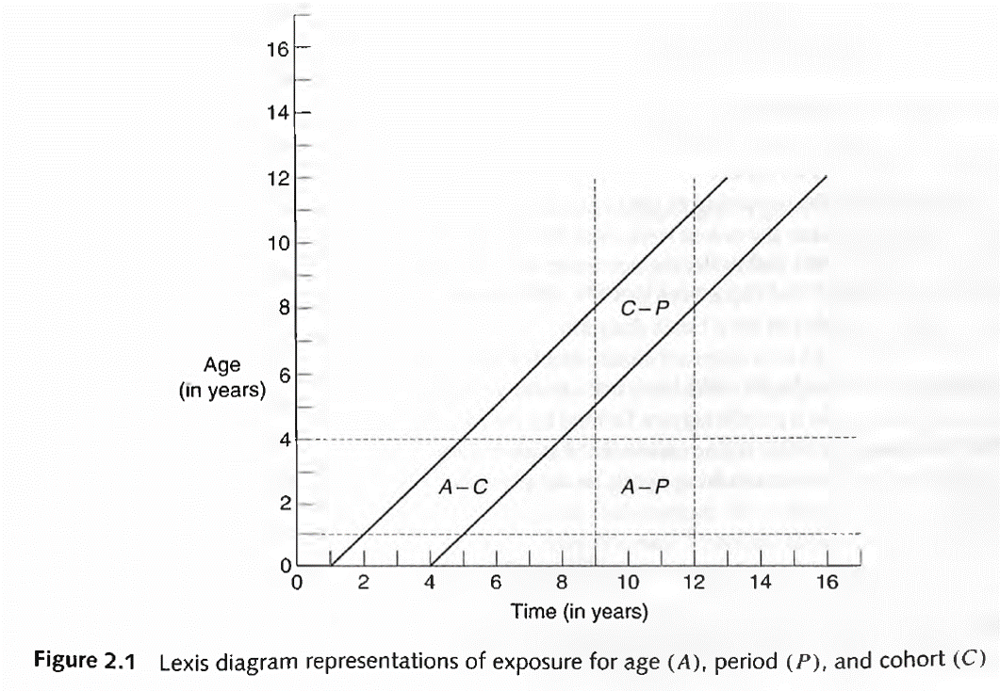
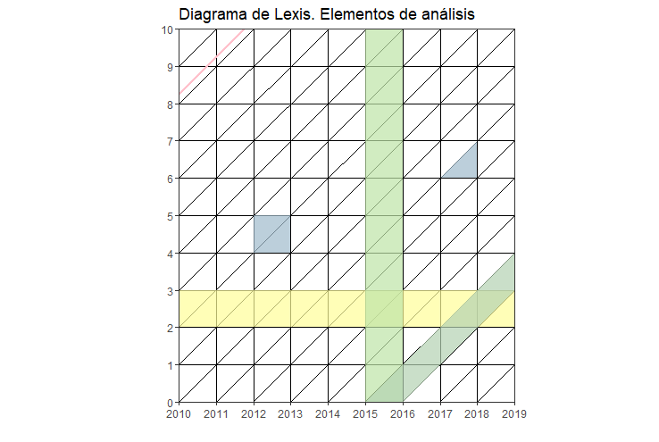
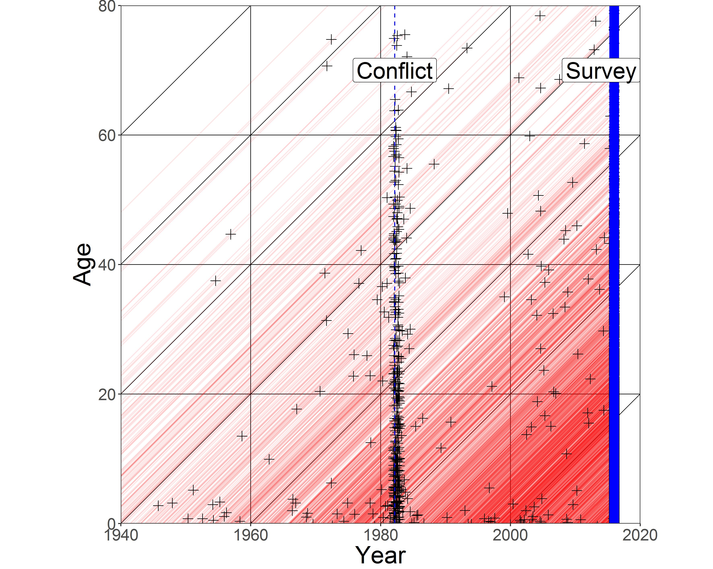

# ggplot

## Introducción

En esta sección vamos a explorar la utilidad de R para la visualización de contenido demográfico. En [Riffe y otros (2021)](https://www.demographic-research.org/volumes/vol44/36/default.htm) se publicó una colección de artículos sobre ejemplos de "buena" visualización en este tema. Tambén se reseña un poco de la historia en el tema y se concluye con algunas recomendaciones a la hora de pensar cómo mostrar lo que queremos comunicar.

En la unidad previa trabajamos con una muestra censal a nivel de registro. Aquí contaremos con una distribución por edad y sexo de la población censada en los dos últimos censos e iremos recorriendo distintas formas su contenido. 

```{r, results='hold',out.width="60%",echo=FALSE, fig.cap="https://fineartamerica.com/featured/walking-up-the-pyramid-kirt-tisdale.html?product=shower-curtain"}

```

## ggplot

El paquete [ggplot](https://ggplot2.tidyverse.org/) del entorno *tidyverse* tiene sus fundamentos en la gramática de gráficos (Wilkinson, 2005). ¿Qué es un gráfico estadístico?. La idea es "generalizar" su construcción tal que un paquete no sea una colección de *casos especiales*.

Todo gráfico esta compuesto por:

  - **Datos**
  - **Capas**
    - Expresión *geométrica* de los datos. Lás más comunes son:
      - Puntos (*geom_point*)  
      - Líneas (*geom_line*)  
      - Barras (*geom_bar*) 
    - *Estética* determinada: ¿quién es "x"?, ¿quién es "y"?, tamaño, color y forma (entre otros)
    - *Transformación* estadística (segmentar por percentiles, o ajustar un modelo lineal) 
  - **Sistema de coordenas** y **Escalas**: las medidas relativas con las cuales interpretar los datos y su transformación visual. Personalización de ejes y leyenda, por ejemplo.

```{r, include=F}
getwd()
library(readxl)
N_Censo <- read_xlsx("Data/PoblCensal01y10.xlsx", sheet = 1)
```

Obtengamos la población censal por provincia de los dos últimos censos, en "Data/PoblCensal01y10.xlsx". Seleccionemos CABA y veamos su distribución por edad en 2010 con *ggplot*. 

```{r}
N_CABA <- N_Censo %>% filter(PROV_NOMBRE == "CIUDAD AUTONOMA DE BUENOS AIRES" & CENSO==2010)

# genero un primer gráfico con los tres elementos básicos:
ggplot(data = N_CABA,                 # data
       aes(x = EDAD, y = VARON)) +    # estética
       geom_line()                    # geometría
```

Lo bueno de **>%>**:
```{r}
N_CABA %>% ggplot(aes(x = EDAD, y = VARON)) + geom_line()
```

Podemos compararla con otras provincias en 2010, como Formosa y Entre Ríos, distinguiéndolas por color. Tomemos los varones. ¿Qué observaciones podemos hacer?

```{r}
# creo un vector con las seleccionadas, y filtro la base
Provincias = c("FORMOSA", "ENTRE RIOS", "CIUDAD AUTONOMA DE BUENOS AIRES")
N_Provs <- N_Censo %>% 
  filter(PROV_NOMBRE %in% Provincias, CENSO==2010)

# genero un primer gráfico con los tres elementos básicos:
ggplot(data = N_Provs,                                       # data
       aes(x = EDAD, y = VARON, color = PROV_NOMBRE)) +      # estética
       geom_line()                                           # geometría
```

Podemos adicionar otra capa geométrica de puntos distinguiendo adicionalmente por *forma* (atributo estético adicional). Estos pueden ser incluidos directamente en la capa correspondiente:

```{r}
g_Provs <- ggplot(data = N_Provs, 
                  aes(x= EDAD, y = MUJER, color = PROV_NOMBRE)) + 
           geom_line() +
           geom_point(aes(shape = PROV_NOMBRE))
g_Provs
# acabo de crear un objeto. ¿de qué tipo es?
```

Agreguemos [un título, un subtítulo](https://ggplot2.tidyverse.org/reference/labs.html), modifiquemos el tamaño del punto, la posición y título de la leyenda, y  especifiquemos las marcas en el eje x:

```{r}
g_Provs <- g_Provs +  # partimos del objeto anterior
  labs(title = "Población de varones por edad. Año 2010",
       subtitle = "Provincias seleccionadas",
       caption = "Fuente: INDEC",
       x = "Edad", y = "Varones") +
  theme(legend.position = "bottom", 
        legend.direction = "horizontal",
        legend.title = element_blank()) +
  scale_x_continuous(breaks = seq(0,100,10)) # ups!
g_Provs
```

Podemos definir una paleta de colores, cambiar la [temática](https://ggplot2.tidyverse.org/reference/theme.html) de fondo por una más simple y suavizar las series con algún modelo. Adicionalmente mediante [ggsave](https://ggplot2.tidyverse.org/reference/ggsave.html) podemos guardar el objeto como imágen en la extensión que se desee.

```{r, warning=FALSE}
mi_paleta <- c("#000000", "#E69F00", "#56B4E9") # sistema Hexadecimal de colores

g_Provs <- g_Provs +
  scale_colour_manual(values = mi_paleta) +
  theme_bw() + 
  geom_smooth(method = 'loess', span=.5) # podés jugar con span (0,1)

ggsave(filename = "g_Provs.pdf", plot = g_Provs)

g_Provs
```

Podés encontrar [más colores y paletas prediseñadas](http://www.cookbook-r.com/Graphs/Colors_(ggplot2)/), temáticas [predefinidas](https://ggplot2.tidyverse.org/reference/ggtheme.html) o mediante el paquete [ggthemes](https://yutannihilation.github.io/allYourFigureAreBelongToUs/ggthemes/), y formas de suavizar una serie continua (aquí utilizamos *?loess*).  

Para continuar nuestro camino hacia la pirámide de población con *ggplot*, conviene que *Sexo* sea una única variable con dos categorías (una variable de tipo *factor*). Una buena idea: siempre tratar con **tidy** data. 

```{r, results='hold',out.width="100%",echo=FALSE, fig.cap="https://github.com/allisonhorst/stats-illustrations"}
include_graphics("figs/tidydata.jpg")
```

Para esto utlizaremos las funciones **pivot** (antiguamaente llamadas *gather* y *spread*, por si lo ves en la web). Leamos la hoja de ayuda (*cheat sheet*) de [tidyr](https://tidyr.tidyverse.org/) juntos, otro paquete del entorno *tidyverse*. Y quedémonos por el momento con Entre Ríos.


```{r}
N_ER <- N_Provs %>% 
              pivot_longer(cols = c(VARON, MUJER), names_to = "Sexo", values_to="N") %>% 
              mutate(Sexo = as.factor(Sexo)) %>% 
              filter(PROV_NOMBRE == "ENTRE RIOS") %>% 
              select(-PROV_CODIGO)
head(N_ER)
```

Tenemos nuestra tabla preparada, es el momento de pasar a una geometría de barras. Al momento de trabajar con *barras*, *fill* equivale al atributo *color* de líneas o puntos. Podemos incluir el condicional de signo dentro de la definición de ejes (o de manera previa mediante *mutate*):

```{r}
Pir_ER <- ggplot(data = N_ER, 
                aes(x = EDAD, y = ifelse(Sexo == "VARON", -N, N), fill = Sexo)) +
                geom_bar(stat = "identity") # que ggplot no trate de contar cual histograma
Pir_ER
```

Ups! Hay que dar vuelta (flip) la pirámide. Podemos hacerle unos cambios adicionales de paso: fijar los límites horizantales y mostrar solo absolutos, incluir titulo, subtítulo y fuente, cambiar las etiquetas de ambos ejes, incluir un *tema* distinto y cambiar el color de las barras.      

```{r, message=F}
Pir_ER <- Pir_ER +
            coord_flip() +
            scale_y_continuous(labels = abs, limits = max(N_ER$N) * c(-1,1)) +
            scale_x_continuous(labels = seq(0,110,5), breaks = seq(0,110,5), limits=c(0, 110)) +
            labs(y = "Población", x = "Edad",
                 title = "Pirámide de población. Año 2010",
                 subtitle = "Entre Ríos",
                 caption = "Fuente: en base a INDEC") +
            scale_fill_manual(values = c("red", "green")) +
            theme_bw()
Pir_ER  
```
        
Probablemente querramos comparar provincias, para lo que podemos usar las opciones de [faceting](https://ggplot2.tidyverse.org/reference/facet_grid.html) :

```{r}
N_Provs <-N_Provs %>% 
              pivot_longer(cols = c(VARON, MUJER), names_to = "Sexo", values_to="N") 
               

Pirs <- N_Provs %>% 
                ggplot(aes(x = EDAD, y = ifelse(Sexo == "VARON", -N, N), fill = Sexo)) +
                geom_bar(stat = "identity") +
                coord_flip() +
                scale_y_continuous(labels = abs,
                                   limits = max(N_Provs$N) * c(-1,1)) +
                labs(y = "Población", x = "Edad") +
                labs(title = "Pirámide de población. Año 2010",
                  subtitle = "Entre Ríos",
                  caption = "Fuente: INDEC") +
                scale_fill_manual(values = c("red", "green")) +
                theme_dark() +
                facet_grid(rows = vars(PROV_NOMBRE)) # o cols?
Pirs
```

¿El gráfico nos permite inferir estadíos transicionales? Mmm... Deberíamos verlo en porcentajes. Todo en una sentencia:


```{r}
PirsPorc <- N_Provs %>% 
                group_by(PROV_NOMBRE, Sexo) %>% 
                mutate(Np = round(N/sum(N)*100,2))%>% 
                ggplot() + 
                  aes(x = EDAD, y = ifelse(Sexo == "VARON", -Np, Np), fill = Sexo) +
                  geom_bar(stat = "identity") +
                  coord_flip() +
                  scale_y_continuous(labels = abs) +
                  labs(y = "Porcentaje de población", x = "Edad") +
                  theme_bw() +
                  scale_fill_manual(values =c("blue", "gold"))+
                  facet_grid(cols = vars(PROV_NOMBRE))
PirsPorc
```

Finalmente, cuando necesités guardar el gráfico, por ejemplo como pdf:

```{r, eval = F}
ggsave(plot = "PirsPorc.pdf", filename = PirsPorc)

```


¡Ahora sí! Estamos en condiciones de percibir visualmente qué nos dice el stock por edad y sexo: envejecimiento, efecto migratorio, patrones de declaración censal de edad. ¿Qué más? Quizás si fuera un gráfico interactivo... Un bonus track utilzando [plotly](https://plot.ly/ggplot2/):

```{r}
#install.packages("plotly")
library(plotly)
PirsPorc_plotly <- ggplotly(PirsPorc + aes(text = Np), tooltip= "text") 
```

***

###  Actividad

a) Realizar un gráfico de línea con el índice de masculinidad por edad de la provincia que prefiera, dándole a cada censo un color distinto (al pasar a ser una categoría debe ser *factor*).  

```{r, include=F}
N_Censo %>% 
  filter(PROV_NOMBRE=="Total") %>% 
  mutate(IM = VARON/MUJER*100,
         CENSO = as.factor(CENSO)) %>% 
  ggplot() +
  geom_line(aes(x=EDAD,y=IM, color=CENSO))
```

* Hacer el mismo gráfico pero comparando 5 provincias en 2010.  
```{r, include=F}
N_Censo %>% 
  filter(PROV_NOMBRE%in% Provincias, CENSO==2010) %>% 
  mutate(IM = VARON/MUJER*100,
         PROV_NOMBRE = as.factor(PROV_NOMBRE)) %>% 
  ggplot() +
  geom_line(aes(x=EDAD,y=IM, color=PROV_NOMBRE))
```

a) El primer autor te escribe para incluir el gráfico previo en una publicación. ¿Qué modificaciones le harías para dejarlo listo? 

a) Construir la pirámide de población de CABA, colocando ambos censos uno debajo del otro.

```{r, include=F}
N_Censo %>% filter(PROV_NOMBRE=="CIUDAD AUTONOMA DE BUENOS AIRES") %>% 
                pivot_longer(cols = c(VARON, MUJER), names_to = "Sexo", values_to="N") %>% 
                group_by(Sexo, CENSO) %>% 
                mutate(Np = round(N/sum(N)*100,2))%>% 
                ggplot() + 
                  aes(x = EDAD, y = ifelse(Sexo == "VARON", -Np, Np), fill = Sexo) +
                  geom_bar(stat = "identity") +
                  coord_flip() +
                  scale_y_continuous(labels = abs) +
                  labs(y = "Porcentaje de población", x = "Edad") +
                  theme_bw() +
                  scale_fill_manual(values =c("blue", "gold"))+
                  facet_grid(rows = vars(CENSO))
```

***

## Reproduciendo

¿Te parece genial la figura 1 del paper [Quantifying impacts of the COVID-19 pandemic through life-expectancy losses: a population-level study of 29 countries](https://academic.oup.com/ije/advance-article/doi/10.1093/ije/dyab207/6375510) de Aburto y Otros (2021)? Podemos recrearlo gracias a que los autores lo permiten [aquí](https://github.com/OxfordDemSci/ex2020/blob/master/src/08-plots.R), haciendo su paper reproducible. Iremos comentando los pasos:

```{r}

# necesitamos algunas librerías que no tenemos aún. Si no las tenés debes instalarlas primero
#install.packages("hrbrthemes")
library(hrbrthemes)

# cargar la data

df_ex_ci <- read_rds("Data/df_ex_ci.rds")

# crear el gráfico
fig_1 <- df_ex_ci %>%
  # primero factorizar según el número actual dela variable
  mutate(name = name %>% fct_reorder(rank_e0f19)) %>%
  # me interesa ciertas edades
  filter(age %in% c(0, 60)) %>%
  # si hay alguna NA sacar la fila
  drop_na(name) %>%
  # una forma de seleccionar
  transmute(name, sex, age,ex_2015, ex_2019, ex_2020 = ex) %>%
  # hete aquí un pivot...
  pivot_longer(cols = ex_2015:ex_2020,
               names_to = "year", values_to = "ex", names_prefix = "ex_") %>%
  mutate(age = age %>% as_factor()) %>% 
  # ggplot
  ggplot()+
  # un color por sexo, una forma por año
  geom_point(aes(x = ex, y = name, color = sex, shape = year))+
  # separar un poco con líneas grises
  geom_hline(yintercept = seq(2, 28, 2), size = 5, color = "#eaeaea")+
  # personalizar qué formas, tamaños y colores usar
  scale_shape_manual(values = c(124, 43, 16))+
  scale_size_manual(values = c(4, 4, 1.5))+
  scale_color_manual(values = c("#B5223BFF", "#64B6EEFF"))+
  # donde colocar los nombres de los ejes
  scale_y_discrete(position = "right")+
  scale_x_continuous(position = "top")+
  # facet por edad, sin respetar escala
  facet_grid(~age, scales = "free_x")+
  # tipo especial de fuente de letra
  theme_minimal(base_family = font_rc)+
  # sin leyenda, líneas horizonatales y demases
  theme(
    legend.position = "none",
    panel.grid.major.y = element_blank(),
    panel.grid.minor.y = element_blank(),
    strip.text = element_blank(),
    panel.spacing.x = unit(2, "lines"),
    axis.text.y = element_text(face = 2))+
  # etiquetas de ejes
  labs(x = "Life expectancy, years",y = NULL)
```
Las etiquetas en referencia a la edad y la formas de los puntos las realizaron posteriormente con [annotate](https://ggplot2.tidyverse.org/reference/annotate.html), una función que permite incluir (encima) texto u otras figuras geométricas en el plano.

***

## LexisPLotR

*Gráfico* útil para representar la dinámica poblacional de *ingreso* y *permanencia* en un estadío demográfico según edad, tiempo calendario (o período) y año de nacimiento (o cohorte). Su aplicación más común es en mortalidad, pero es generalizable a la relación exposición~evento con múltiples  [usos](https://apuntesdedemografia.com/curso-de-demografia/temario/tema-2-generalidades/el-diagrama-de-lexis/).  
{width=500px}

Los elementos principales de análisis son:

* Líneas de vida (45°)  
* Segmentos horizontales y verticales  
* Superficies  



Ejemplos de uso del diagrama utilizando R:

* Mortalidad por conflictos armados (replicable):

Fuente: Alburez et. al (2019)

* Sobremortalidad masculina en Inglaterra y Gales (1841-2013):

Fuente: Schöley & Willekens (2017)

Construyamos el diagrama básico del inicio. Para eso haremos uso del paquete [LexisPlotR](https://github.com/ottlngr/LexisPlotR) creado por Philipp Ottolinger (gracias Otto). Construyó un set de funciones basadas en *ggplot* que facilita la creación de diagramas haciéndolo un ejercicio intuitivo. 

```{r}
# install.packages("devtools")
# devtools::install_github("ottlngr/LexisPlotR") #¿Cómo no esta en CRAN?
library(LexisPlotR)
library(tidyverse)

# creamos el objeto "mylexis", definiendo el rango de sus ejes: los primeros 10 años de vida durante 2010-2019. Aquí podemos especificar un "delta" si es que nos interesan los grupos quinquenales.
mylexis <- lexis_grid(year_start = 2010, year_end = 2019, age_start = 0, age_end = 10)

# pintamos la edad 2
mylexis <- lexis_age(lg = mylexis, age = 2)

# pintamos el año 2015, de gris en este caso.
mylexis <- lexis_year(lg = mylexis, year = 2015, fill = "grey")

# Ahora la cohorte 2015
mylexis <- lexis_cohort(lg = mylexis, cohort = 2015)

# Una línea de vida, ¡elemento fundamental del diagrama!
mylexis <- lexis_lifeline(lg = mylexis, birth = "2001-09-23", lwd = 1, colour = "pink")

# Al ser un objeto ggplot, podemos incorporarle atributos, como el título
mylexis <- mylexis + labs(x="Año", y = "Edad",title = "Diagrama de Lexis. Elementos de análisis")

# Para crear polígonos, el autor se basa en la geometría "geom_polygon". Creamos un cuadrado. El orden de los datos es importante. Además podemos crear muchos polígonos al mismo tiempo señalando los grupos.
square <- data.frame(group = c(1, 1, 1, 1),
                       x = c("2012-01-01", "2012-01-01", "2013-01-01", "2013-01-01"),
                       y = c(4,             5,            5,            4))
mylexis <- lexis_polygon(lg = mylexis, x = square$x, y = square$y, group = square$group)

# Creamos el triángulo. ¿A qué refiere?
triangle <- data.frame(group = c(1, 1, 1),
                       x = c("2017-01-01", "2018-01-01", "2018-01-01"),
                       y = c(6, 6, 7))
mylexis <- lexis_polygon(lg = mylexis, x = triangle$x, y = triangle$y, group = triangle$group)

# Imprimimos!
mylexis
```

Adicionalmente, si trabajamos con población donde la exposición puede ser truncada (por derecha o izquierda), podemos graficar líneas de vida que respeten ese comportamiento. Tambien podemos señalar con una cruz la ocurrencia del evento de salida que se estudia.

```{r}
# ingresa al estudio sobre deserción escolar en el año 2012 un niño/a nacido en el año 2005, abandonando el colegio a los 9 años de edad:
mylexis <- lexis_lifeline(lg = mylexis, 
                          birth = "2005-09-23", 
                          entry = "2012-06-11", exit = "2015-02-27", lineends = T,
                          colour = "red")
mylexis
```

Pero atrás de esto esta ggplot!

```{r}
ggplot() +
  geom_segment(aes(x = 2011, y = 5, xend = 2015, yend = 9), color = "red", size=1)+ # debería ir al final
  geom_point(aes(x=2015, y=9),shape=4,size=2)+
  coord_equal() +
  scale_x_continuous(breaks=2010:2020, expand = c(0,0)) +
  scale_y_continuous(breaks=0:10, expand = c(0,0)) +
  geom_vline(xintercept = 2010:2020, color="grey", size=.15, alpha = 0.8) +
  geom_hline(yintercept = 0:10, color="grey", size=.15, alpha = 0.8) +
  geom_abline(intercept = seq(-2020, -2000, by=1), slope = 1, color="grey", size=.15, alpha = 0.8)+
  labs(x="Año", y="Edad",title = "Dieagrama de Lexis c/ ggplot")+
  theme_minimal()+
  theme(panel.grid.major = element_line(colour = NA),
        panel.grid.minor = element_line(colour = NA),
        plot.background = element_rect(fill = "white", 
                                       colour = "transparent"))
```

Para incluir triángulos y cuadriláteros se utiliza [geom_plygon](https://ggplot2.tidyverse.org/reference/geom_polygon.html). Para dar superficie, de manera similar al gráfico Scholey & Willekens (2017), se utiliza [geom_tile](https://ggplot2.tidyverse.org/reference/geom_tile.html). Para esto último un gran tutorial de [Tim Riffe](https://timriffe.github.io/DemoTutorials/LexisSurface).

***

## Estudio de cohorte: un ejemplo

Construyamos una tabla de cohorte a partir de un grupo de estudiantes que iniciaron con 3 años de edad su trayectoria educativa el 3/3/2000, y donde la *salida* es dejar el estudio (sea cual sea el nivel alcanzado) por primera vez antes de retomar o abandonar definitivamente (¿en este contexto qué sería $\omega$?). Simulemos el comportamiento de 1000 chicas/os con distribución *uniforme* de la edad y distribución *gamma* del tiempo de permanencia:

```{r}
set.seed(100) # qué es esto?
clase <- data.frame(edad_inicio = runif(n = 1000, min = 3, max = 4),
                    tiempo_exp = rgamma(n = 1000, shape = 40, rate = 2)) %>% 
          mutate(edad_salida = edad_inicio + tiempo_exp)
```

```{r}
ggplot(clase) + 
  geom_density(aes(x=edad_salida), fill=2, alpha=.1)+
  labs(x="Edad de salida", y="Densidad", title="1000 casos simulados de permanencia inicial")
```


Contruyamos el diagrama de Lexis de esta cohorte:
```{r}
mylexis     <- lexis_grid(year_start = 2000, year_end = 2025, age_start = 3, age_end = 30)
nacimiento  <- as.Date("2000-03-03") - clase$edad_inicio * 365.25
salida      <- nacimiento + clase$tiempo_exp * 365.25
mylexis     <- lexis_lifeline(lg = mylexis, 
                          birth = nacimiento, 
                          entry = "2000-03-03", 
                          exit = salida, lineends = T,
                          colour = 4, alpha = 1/3)
mylexis
```

Si tuviéramos que estimar...
```{r, results='hold'}
# la edad media de salida
mean(clase$edad_salida)

# la probablidad de "sobrevivir" a la edad 18
clase %>% filter(edad_salida >= 18) %>% summarise(`18p0` = n()/nrow(clase)) 

# probablidad de abandonar en los 20 años cumplidos 
clase %>% filter(edad_salida >= 20 & edad_salida < 21) %>% summarise(`1p20*1q20` = n()/nrow(clase))
```

### Actividad

a) Crear un diagráma de Lexis y señalar las líneas de vida de tus 5 parientes más cercanos. Selecciona los rangos de los ejes para que la visualización sea buena.

a) Crear un diagrama de Lexis señalando los fallecidos en 2015 con edad 15, diferenciando cada cohorte con dos colores distintos.

a) Considerando el ejercicio de permanencia escolar:
    - Destaca con una cruz roja aquellos dos niñas/os que abandonaron primero y último.
    - Calcula la esperanza de vida de permanencia "inicial" (en el sentido antes aclarado), si es que no lo hicimos ya.
    - Cambia la semilla del ejercicio previo (`set.seed()`) por cualquier entero que desees y repite el ejercicio. ¿Hay diferencias?¿Por qué?

## Recursos Adicionales

* Hulíková Tesárková & Kurtinová. Application of “Lexis” Diagram: Contemporary Approach to Demographic Visualization and Selected Examples of Software Applications.

* Rau, R., Bohk-Ewald, C., Muszyńska, M. M., & Vaupel, J. W. (2018). Visualizing Mortality Dynamics in the Lexis Diagram. Springer. doi: 10.1007/978-3-319-64820-0

***

## Otras visualizaciones

S. Preston (1975) encontró una relación matemática (al menos) a nivel de país entre la esperanza de vida al nacer y el producto per cápita. Veamos que ocurre específicamente en el Continente Americano utilizando el paquete de datos *gapminder*.

```{r}
library(gapminder)
p <- ggplot(filter(gapminder, continent == "Americas"),
            aes(x = gdpPercap, y = lifeExp))
p + geom_point() # dispersión
p + geom_point(aes(color = country), alpha = (1/3), size = 3, show.legend = F) 
p1 <- p + geom_point(aes(color = country, size = pop), alpha = 1/3) # fijate el lugar de size 
p1 <- p1 + geom_smooth(lwd = 1, lty = 2, color = 2, se = FALSE)
p1
p + geom_point(alpha = 1/3, size = 3) + facet_wrap(~ country) +
    geom_smooth(lwd = 1.5, se = FALSE) +
    theme_void()
```

¿Componer gráficos en una sola hoja? (tomado de [Jenny Bryan](https://stat545.com/))
```{r}
#install.packages("gridExtra")
library(gridExtra)
p2 <- ggplot(filter(gapminder, year==1952 & continent!="Oceania"), aes(x = lifeExp, color = continent))       + geom_density()
p3 <- ggplot(filter(gapminder, year==2007 & continent!="Oceania"), aes(x = lifeExp, color = continent))       + geom_density()
grid.arrange(p2, p3, nrow = 2, heights = c(0.5, 0.5))
```

¿Qué problemas encuentras en este arreglo?

## Material adicional (y no tanto)

* Sí, hay un [libro](https://ggplot2-book.org/index.html).

* Estas notas fueron hechas siguiendo principalmente [The Hitchhiker's Guide to Ggplot2](https://leanpub.com/hitchhikers_ggplot2) y el curso de [Jenny Bryan](https://stat545.com/).  

* [Hoja de Ayuda](https://github.com/rstudio/cheatsheets/blob/main/data-visualization-2.1.pdf).  
