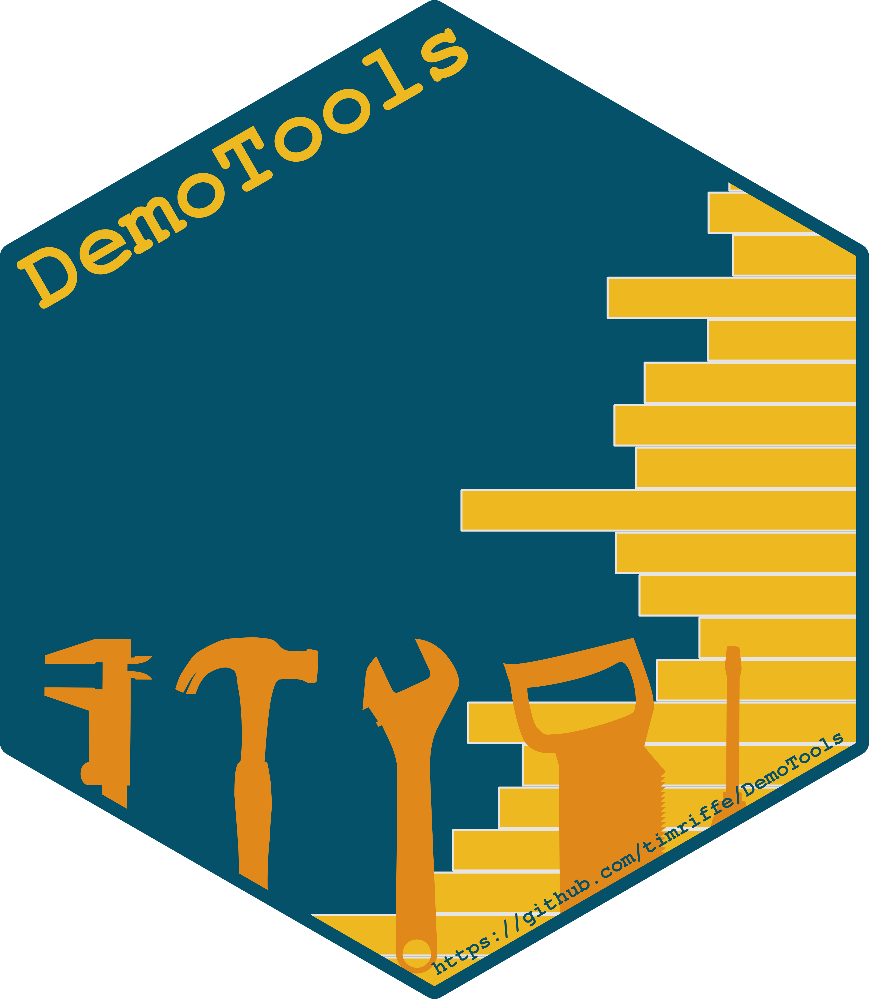

# Funciones

```{r include=FALSE}
knitr::opts_chunk$set(echo = TRUE, warning = F)
library(knitr)
library(fontawesome)
library(tidyverse)
Sys.setlocale("LC_ALL", "Spanish_Spain.UTF-8")
```

## DemogRafía

¿Qué es la demografía? Algunas definiciones (tomado de [Carmichael, 2016](https://www.springer.com/gp/book/9783319232546)):

>Guillard (1855; citado en Shryock, Siegel and Associates, 1973): "la historia natural y social de la especie humana o el conocimiento matemático de las poblaciones, de sus cambios generales y de su condición física, civil, intelectual y moral".

>Hauser y Duncan (1959): La demografía es el estudio del tamaño, la distribución territorial y la composición de la población, los cambios en la misma y los componentes de dichos cambios, que pueden identificarse como natalidad, mortalidad, movimiento territorial (migración) y movilidad social (cambio de estado).

>Weeks (1994): La demografía se refiere a prácticamente todo lo que influye, o puede ser influenciado por el tamaño de la población, su distribución, procesos, estructura o características de ella.

>Preston et. al, (2001): cambios en su tamaño, sus tasas de crecimiento y su composición. La demografía es uno de las disciplinas de las ciencias sociales donde los análisis a nivel micro y macro encuentran quizás su más completa y satisfactoria articulación.

Palabras clave: *especie + tamaño + composición + territorio + estado + cambio + micro/macro*.

## Funciones

Una función consiste en **encapsular** un proceso, que recibe argumentos y devuelve un resultado. En general, si un bloque de código es copiado y pegado en más de una vez en un espacio de trabajo entonces merece su función. Las funciones en R contienen:

- un **nombre**

- **argumentos** (input) ¿Qué necesita?

- **cuerpo** (código que elabora una respuesta en función de argumentos)

- **respuesta**/resultado (output). ¿Qué devuelve?

```{r, eval = F}
  # se enuncia entre llaves
  nombre<- function(argumentos) { 
    código
  return(resultado)
  }
```

Por ejemplo, si queremos tener una función que nos diga cuantos años cumplidos tendrá una persona de edad *x* en *t* años:

```{r}
edad_en_t_anios <- function(x, t){
  x_en_t_años <- x + t
  # este valor solo existirá en este contexto (scoping)
  return(x_en_t_años)
}

# Juan tiene 35. ¿Cuantos tendrá en 10 años?
edad_en_t_anios(35, 10) # no nombré los argumentos porque respeté el orden

# Edades de un hogar en 5 años
edades <- c(59, 58, 32, 30, 25, 25)
edad_en_t_anios(edades, 5)
```

Las funciones pueden tener valores por defecto. Por ejemplo:

```{r}
edad_en_t_anios <- function(x, t = 5){
  x_en_t_años <- x + t
  return(x_en_t_años)
}

edad_en_t_anios(x = 35)
```

## Crecimiento

Tenemos una población que en el año 2010 era de 50.000 personas y en 2020 era de 60.000. Nos preguntan cual sería la población a 2025. Existen distintas formas en que podemos modelar su crecimiento total a partir de dos puntos observados en el tiempo. En términos generales para un momento 0 y un momento t, debemos obtener primero el ritmo al que crece, es decir su tasa anual promedio $\overline{r}(0,t)$: 

|Supuesto | $N(t)$ | $\overline{r}(0,t)$|
|---------|--------|-------|
|Lineal | $N(0) * (1+r*t)$ | $[\frac{N(t)}{N(0)}-1]/t$
|Exponencial| $N(0) * e^{r * t}$ | $\ln(\frac{N(t)}{N(0)})/t$
<!-- |Geométrica | $N(t) = N(0) * (1+r)^t$ | $r = [\frac{N(t)}{N(0)}-1]^{1/t}$ -->
Construyamos una función para modelar su crecimiento y poder interpolar/extrapolar según el modelo *lineal*. Una función debe ser diseñada para ser aplicable a muchos casos específicos.
Llamaremos `h` a la distancia desde la primera observación para la que deseamos obtener la nueva población.

```{r}
crecim_lineal <- function(N0, Nt, t, h){
  r  <- (Nt/N0-1)/t
  Nh <- N0 * (1+r*h)
  return(Nh)
}
```

Nuestra respuesta a la pregunta inicial podría ser, siendo `h = 15`:

```{r}
# ¿qué población habrá en 2025?
N2025 <- crecim_lineal(N0 = 50000, Nt = 60000, t = 10, h = 15)

# miremos un gráfico
data.frame(Año = c(2010,  2020,  2025),
       N   = c(50000, 60000, N2025)) %>% 
  ggplot(aes(Año, N)) + 
  geom_line() + 
  geom_point() 
```

¿Si quisiera tener opciones al momento de calcular el crecimiento? Por ejemplo, que sea de tipo lineal o exponencial. Incluyamos el argumento `tipo` y utilicemos el condicional `if` para posicionarnos en el modelo que se quiera.
 
```{r}
crecim <- function(N0, Nt, t, h, tipo = "lineal"){
  # si se quiere el modelo exponencial
  if(tipo == "exponencial"){
    r <- log(Nt/N0)/t
    Nh <- N0 * exp(r*h)  
  }
  # si se quiere el modelo lineal
  if(tipo == "lineal"){
    Nh <- crecim_lineal(N0, Nt, t, h) # una función dentro de otra!!!
  }
  return(Nh)
}
```

Veamos que obtuvimos con las dos opciones:

```{r}
N2025 <- data.frame(N2025_lineal = crecim(50000, 60000, 10, 15, tipo = "lineal"),
                    N2025_exp    = crecim(50000, 60000, 10, 15, tipo = "exponencial"))

data.frame(Año = c(2010,  2020,  2025, 2025),
           N   = c(50000, 60000, N2025$N2025_lineal, N2025$N2025_exp),
           Tipo = c("Observado", "Observado", "lineal", "exponencial")) %>% 
  ggplot(aes(Año, N)) + 
  geom_point(aes(shape = Tipo, color=Tipo)) 
```

El condicional puede pensarse como `if` y `else` también, ¿cómo sería? 

¿Y si tuviéramos un vector de población por edad? Podemos tener una tasa $\overline{r}(0,t)$ por cada edad.

```{r}
# crecimiento por edad
N2025_edad <- data.frame(Edad = c("0-14", "15-64", "65+"), 
                         N2010   = c(20000, 20000, 10000),
                         N2020   = c(25000, 30000, 5000)) %>% 
              mutate(N2025_lineal = crecim(N2010, N2020, 10, 15, tipo = "lineal"),
                     N2025_exp = crecim(N2010, N2020, 10, 15, tipo = "exponencial"))

# hagamos tidy el data.frame primero
N2025_edad %>% 
  pivot_longer(cols = !Edad, names_to = "Tipo", values_to = "N") %>% 
  ggplot(aes(Edad, N, fill = Tipo)) + 
  geom_bar(stat = "identity", # no trates de ser un histograma
           position = "dodge") # posición lado a lado
```

El poner a disposición de otros usuarios tus funciones requiere controlar los errores posibles, entre otras cosas por ingresar como argumentos objetos no esperados (por ejemplo, un objeto *character* en algunos de los primeros argumentos). Ejemplo: hagamos no aceptable el ingreso de un objeto `character` como argumento en `N0`, `Nt`, `t` ni `h`:

```{r,eval=F}
crecim_lineal_check <- function(N0, Nt, t, h){
  # check argumentos
  if(is.character(N0) | is.character(Nt) | is.character(t) | is.character(h)){
    stop("Ingresaste un texto en algún argumento")
  }
  # función previa
  r  <- (Nt/N0-1)/t
  Nh <- N0 * (1+r*h)
  return(Nh)
}

# probemos
crecim_lineal_check(50000, 60000, 10, "hola")

```

### Actividad

a) Crear una función que sume un vector de población y devuelva el resultado en miles.

```{r}
sumar_en_miles <- function(x){
  round(sum(x)/1000)
}
sumar_en_miles(N2025_edad$N2010)
```


a) Siguiendo el ejemplo trabajado: ¿cuál sería la población al 2017 bajo el supuesto de crecimiento exponencial? ¿Es equivalente interpolar cada edad y luego sumar? ¿Y para el tipo lineal?

```{r, eval = F, include = F}
crecim(50000, 60000, 10, 7, tipo = "exponencial")
sum(
  crecim(c(20000, 20000, 10000), 
         c(25000, 30000, 5000), 10, 7, tipo = "exponencial")
  )
```

a) Crear una función que informe la edad modal, por ejemplo para `data.frame(Edad = c(0,4,7,10), Casos = c(2, 6, 9, 0))` debería devolver la edad 7. 

```{r, eval = F, include = F}
Edad = c(0,4,7,10)
Casos = c(2, 6, 9, 125)
get_edad_modal <- function(Edad, Casos){
  Edad[which(Casos==max(Casos))[1]]
}
get_edad_modal(Edad, Casos)
```

a) Obtener una función que permita conocer en cuantos años (h) se duplicará la población respecto al primer valor observado, bajo el supuesto de crecimiento lineal y exponencial. (Ayuda: obtén $r$ y luego despeja $h$ para que $N_h=N_0*2$).

```{r, eval = F, include = F}
h_doblar <- function(N0, Nt, t, tipo = "lineal"){
  if(tipo == "exponencial"){
    r <- log(Nt/N0)/t
    h <- log(2)/r
  }
  if(tipo == "lineal"){
    r  <- (Nt/N0-1)/t
    h <- (2 - 1)/r
  }
  return(h)
}
h_doblar(50000, 60000, 10)
```

## Estandarizando

Entre los intentos por discriminar el efecto de la estructura por edad en el indicador de Tasa Bruta de Mortalidad $TBM(t)=\frac{D(t)}{N(t)}$ (defunciones sobre población expuesta^[Para ser más rigurosos en la notación $N(t)$ debería ser expresado como $\overline{N}(t,t+1)$, pero simplificaremos un poco para enfocarnos en lo que haremos en R. Para más detalles ver Preston y otros (2001)]) se encuentra el clásico método de *estandarización* directa (Swanson & Siegel, 2004). 

En principio, la $TBM(t)$ de una población puede ser expresada como el promedio ponderado de las tasas específicas de mortalidad $M_x(t)=\frac{D_x(t)}{N_x(t)}$ por el peso poblacional de cada edad $C_x(t)=\frac{N_x(t)}{N(t)}$:

$$
TBM(t) = \frac{D(t)}{N(t)}= \sum_{x>=0}{M_x(t)\,C_x(t)}
$$

Poblaciones envejecidas tendrán una mayor frecuencia de muertes debido a la distribución de $C_x(t)$, pero no reflejando su nivel. El proceso de estandarización reemplaza $C_x(t)$ por otra distribución que permita la comparación entre distintas poblaciones: sería equivalente a asignarle **una misma pirámide poblacional** a ambas poblaciones. Si llamamos a esta distribución *estándar* tenemos $C^S_x(t)$ y podemos calcular para dos poblaciones cualquiera $A$ y $B$ su Tasa Estandarizada de Mortalidad:

$$
TSM^A(t) = \sum_{x>=0}{M^A_x(t)\,C^S_x(t)}\\
TSM^B(t) = \sum_{x>=0}{M^B_x(t)\,C^S_x(t)}\\
$$

Lo que permite comparar $TSM^A(t)$ con $TSM^B(t)$: $TSM^A(t) \lessgtr TSM^A(t)$. Pero vayamos al ejemplo!!!

Obtengamos la población y defunciones de Chile, Japón y Polonia del año 2000 y 2010 leyendo la tabla "Chile_Japon_Polonia.csv" en la carpeta "Data". ¿Cómo obtuve esta información? Directamente desde R hacia el repositorio de la [Human Mortality Database](https://www.mortality.org/), utilizando el paquete `HMDHFDplus`. Por ejemplo en este caso las defunciones de Chile por grupos quinquenales de edad (en realidad se muestra la edad inicial de cada intervalo) cada 5 años calendario, "Deaths_5x5", se pueden obtener con la función `readHMDweb`.

```{r, eval=F, include = F}
D_CHL <- HMDHFDplus::readHMDweb(CNTRY = "CHL",item = "Deaths_5x5", 
                                username = "ivanwilliams1985@gmail.com", # create el tuyo!
                                password = "AD2")
```
```{r, include=T}
db <- readxl::read_xlsx("Data/Chile_Japon_Polonia.xlsx")
```

Enfoquémonos en el 2010 para comparar los tres países. Japón presenta una $TBM$ mayor pero atribuible a otro estadío en su envejecimiento según la porción de población de 65 años y más.

```{r}
db <- db %>% filter(Year == 2010)

db %>% 
  group_by(Country) %>% 
  summarise(TBM = sum(D)/sum(N)*1000,
            porc_65_mas = sum(N[Age>=65])/sum(N)) 
```

Y esto es visible en la jerarquía de las tasas de mortalidad por edad:

```{r}
# creamos la varibale con las tasas de mortalidad específicas
db <- db %>% mutate(M = D/N)

ggplot(db)  +
  geom_step(aes(x=Age,y=M,color=Country))+
  scale_y_log10()+
  scale_x_continuous(breaks = seq(0,110,10), labels = seq(0,110,10)) +
  labs(caption = "Human Mortality Database")+
  theme_bw()
```

Estandaricemos utilizando el promedio de la estructura por edad de los tres:

```{r}
C_x_promedio <- db %>% 
              group_by(Age) %>% 
              summarise(c_x = sum(N)/sum(db$N))

db %>%
  left_join(C_x_promedio) %>% 
  group_by(Country) %>% 
  summarise(TSM = sum(M * c_x)*1000)
```

!Ahora sí! El indicador nos muestra un nivel de mortalidad para 2010 mayor en Polonia, seguido de Chile y Japón. Cabe aclarar que en este sentido el mejor indicador resumen es la esperanzada de vida ($e_x$), que se estima a partir de la construcción de una tabla de vida (Preston y otros, 2001).

¿Cómo sería una función que reciba una tabla con las variables `País`, `N` y `D` y devuelva las $TBM$ y las $TSM$?

### Actividad

a) Responder la pregunta previa con los mismos datos utilizados arriba.

```{r, include=F}
standarizarrr <- function(db){
  C_x_promedio <- db %>% 
              group_by(Age) %>% 
              summarise(c_x = sum(N)/sum(db$N))
  resultado <- db %>%
              mutate(M = D/N) %>% 
              left_join(C_x_promedio) %>% 
              group_by(Country) %>% 
              summarise(TBM = sum(D)/sum(N)*1000,
                        TSM = sum(M * c_x)*1000)
  return(resultado)
}
standarizarrr(readxl::read_xlsx("Data/Chile_Japon_Polonia.xlsx") %>% filter(Year==2010))
```

a) Con los datos de la tabla "Chile_Japon_Polonia.csv": ¿qué se puede decir sobre la evolución de la mortalidad de Polonia en los años 1990, 2000 y 2010? ¿Bajó o creció?

```{r, include=F}
db_act <- readxl::read_xlsx("Data/Chile_Japon_Polonia.xlsx") %>% 
  filter(Country == "Polonia", Year %in% c(1990, 2000, 2010))
C_x_promedio <- db_act %>% 
              group_by(Age) %>% 
              summarise(c_x = sum(N)/sum(db$N))
db_act %>%
              mutate(M = D/N) %>% 
              left_join(C_x_promedio) %>% 
              group_by(Year) %>% 
              summarise(TBM = sum(D)/sum(N)*1000,
                        TSM = sum(M * c_x)*1000)
```


a) Graficar la distribución de las defunciones por edad (colocando cada punto en la edad media del intervalo, por ejemplo para el grupo 5-10, en 7.5).

## Funciones demográficas en paquetes demográficos

> Estamos entrando en zona de utilización de funciones demográficas de paquetes.

```{r, echo=F}

```

Proyecto [DemoTools](https://timriffe.github.io/DemoTools/). Su instalación demora un poco:

```{r, out.width="35%", echo=F}

```

```{r, eval=F}
library(devtools)
install.packages("rstan", repos = c("https://mc-stan.org/r-packages/", getOption("repos")))
install_github("timriffe/DemoTools")
```

### Tablas de mortalidad

Construir una función que produzca una **tabla de mortalidad** a partir de un set de tasas por edad de mortalidad es un lindo ejercicio de programación en R. Pero por suerte `DemoTools` tiene una muy buena implementación. Acá para Japón 2010:

```{r}
jpn_2010 <- db %>% filter(Country == "Japon", Year == 2010)

# obtengo la tabla
library(DemoTools)
tm_jpn_2010 <- lt_abridged(nMx = jpn_2010$M, Age = jpn_2010$Age)

# veamos la función de sobrevivencia:
tm_jpn_2010 %>% 
  ggplot(aes(Age, lx)) + 
  geom_point() +
  geom_line()+
  theme_bw()
```

Repasemos sus argumentos, como `OAGNew`, `extrapLaw` y `a0rule`. También puede `graduar`, es decir pasar a edades simples.

### Evaluación de declaración de edad

Con el índice de **Myers** veamos si en Chaco mejoró la declaración por edad de varones entre los censos 2001 y 2010. Un valor del indicador que tienda a 0 indica una mejor declaración (bajo los supuesto del método).

```{r}
pob_chaco <- readxl::read_xlsx("Data/PoblCensal01y10.xlsx", sheet=1) %>% 
                filter(PROV_NOMBRE == "CHACO")

pob_chaco %>% 
  ggplot(aes(EDAD, VARON, color=factor(CENSO))) + 
  geom_point() + 
  geom_line() + 
  scale_x_continuous(breaks = seq(0,100,5), labels = seq(0,100,5)) +
  theme_bw()
  
# obtengo Myers
pob_chaco %>%
  summarise(Myers_2001 = check_heaping_myers(VARON[CENSO==2001], EDAD[CENSO==2001], ageMin = 20, ageMax = 64),
            Myers_2010 = check_heaping_myers(VARON[CENSO==2010], EDAD[CENSO==2010], ageMin = 20, ageMax = 64))
```

### Graduación de población por edad simple

El método de **Sprague** desagrega por edad simple conteos agrupados por edad quinquenal. Veamos como funciona para los varones de Chaco en el año 2010. Primero agregando, y luego aplicando el método.

```{r}
# me quedo con 2010
pob_chaco_2010 <- pob_chaco %>% filter(CENSO == 2010)

# agrupo la población por grupos quinquenales
pob_chaco_2010_quinquenal <- pob_chaco %>%
  filter(CENSO == 2010) %>% 
  mutate(EDAD_q = trunc(EDAD/5) * 5) %>% 
  group_by(EDAD_q) %>% 
  summarise(VARON = sum(VARON))

# aplico sprague
pob_chaco_2010_sprague <- graduate(pob_chaco_2010_quinquenal$VARON, pob_chaco_2010_quinquenal$EDAD_q, method = "sprague")

# junto
pob_chaco_2010_simple <- pob_chaco_2010 %>% 
  full_join(tibble(EDAD = 0:110, VARON_sprague = pob_chaco_2010_sprague)) %>% 
  select(EDAD, VARON, VARON_sprague) %>% 
  pivot_longer(!EDAD, names_to="Tipo", values_to="Población")

# visualizo
pob_chaco_2010_simple %>% 
  ggplot(aes(EDAD, Población, color=Tipo)) +
  geom_line() + 
  geom_point()
```

### Actividad

a) Evaluar la declaración en edades terminadas en 0 y 5 con el indicador *Whipple*, para la provincia que prefiera. ¿qué conclusión puede obtener?

