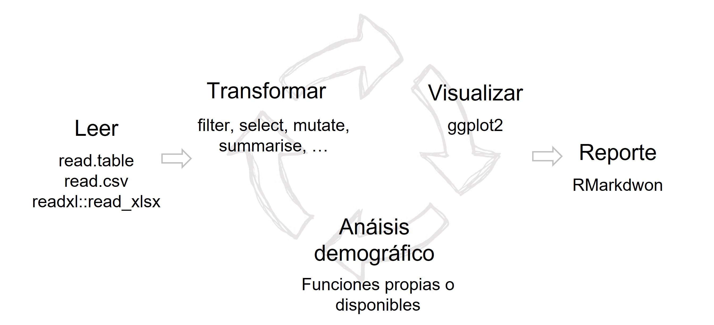
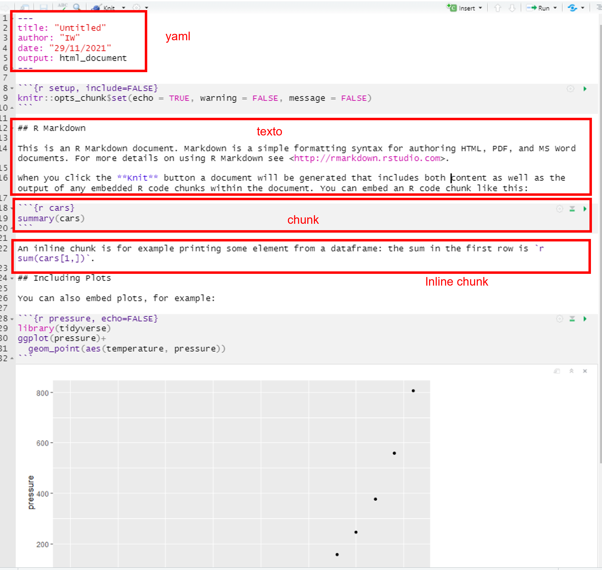

# Reportes

```{r include=FALSE}
knitr::opts_chunk$set(echo = TRUE, warning = F)
library(knitr)
library(fontawesome)
library(tidyverse)
Sys.setlocale("LC_ALL", "Spanish_Spain.UTF-8")
```

## Comunicación y Reproducibilidad

Hasta acá fuimos realizando el siguiente flujo:

```{r, echo=F}

```


Lo que resta: **¿cómo comunicarlo?**.

Para esto aprenderemos las nociones básicas de [RMarkdown](https://rmarkdown.rstudio.com/), que integra **texto + código**, permitiendo la reproducibilidad que comentamos al inicio del taller.

```{r}
# install.packages("rmarkdown")
library("rmarkdown")
# install.packages("knitr")
library("knitr")
```


Aquí veremos la opción para generar documentos/reportes pensando en diseñar tu próximo paper o informe de resultados. 

Empecemos por crear un documento **R Markdown** mediante el template (muestra) por defecto de RStudio en *HTML* (yendo a *File > New File > R Markdown*), y démosle un nombre. Ten a mano la [Hoja de Ayuda](https://www.rstudio.com/blog/the-r-markdown-cheat-sheet/).

¡Antes que nada! Veamos qué genera sin modificarlo. Debemos ejecutar *Knit*, mediante el botón en el menú o *Ctrl + Shift + K* (internamente RStudio, mediante el paquete [knitr](https://en.wikipedia.org/wiki/Knitr), integra el documento [markdown](https://en.wikipedia.org/wiki/Markdown) con los resultados del código en R, para que luego el paquete [pandoc](https://pandoc.org/) lo convierta al tipo que deseás).

Lo que acabas de ver es un tipo de salida _HTML_, pero puedes lograr un pdf o word también (cada uno tiene un template para que exprimentes). Más allá de este formato, la estructura de todo documento tiene tres partes: **YAML** (o cabezal), el **texto** y los **chunks**. 

* **YAML** (cabezal): va al inicio entre giones medio `---`. Explicita las propiedades generales del documento: título, autor, formato de salida (*html*,*pdf*, etc.) y fecha en que se produjo el documento.

* **Texto**: En el segundo escribimos jerárquicamente el documento, señalizando esto mediante sucesivos asteri`s`cos`. `. Por ejemplo los títulos, subtítulos tendrán `#` y `##` (esto será importante si quieres dejar visible un índice). Imagínate las funcionalidades cuando escribes en Word, esto es similar: cursiva `*cursiva*`, negrita `**negrita**`,  ecuaciones x^2 `$x^2$`, hipervínculos `[link](www.rstudio.com)` etc. El salto de párrafo se realiza mediante dos espacios o doble enter.

* **Chunks**: acá va el `¡CÓDIGO!`, lo que se va generando en la sesión del documento. Los insertas mediante el botón en el menú o combinando las teclas *Ctrl + Alt + I*. Se activa comenzando con ```{r} y se finaliza con ```.
Como atributos principales de los chunks se encuentran: 
    - `r` señalando el lenguaje (se puede nombrar el chunk tambien), 
    -  `eval` (¿corro el chunk cuando hago `knit`?), 
    - `echo` (¿Muestro el código?),  
    - `message` (¿muestro los mensajes del proceso?). 
    - `warnings` (¿muestro las advertencias del proceso?).

También pueden generarse líneas de código [en el medio de una oración](https://rmarkdown.rstudio.com/lesson-4.html).

Visualicemos sus partes:

```{r, echo=F}

```

> Dentro de RMarkdown el directorio de trabajo es aquel donde se encuentra el ".Rmd".

## Actividad guiada

Hagamos un documento a partir del template creado, que nos deje *un esqueleto* para la resolución del TP final.

Desde la Secretaría de la Vivienda estan preocupados por la situación habitacional de los porteños, y para tener una primer referencia nos solicitan un breve reporte sobre el porcentaje de viviendas particulares no habitadas según Comuna en 2010, en lo posible segmentando tres grupos en un mapa. El reporte deberá mostrar el porcentaje de viviendas deshabitadas en un mapa y en una tabla, comentando en el texto cuantas vivendas particualres hay en total. 

Para la construcción del mapa primero obtengamos el archivo [shapefile](https://es.wikipedia.org/wiki/Shapefile), que contiene los elementos geográficos, su geo-localización y su relación con el plano. Haremos uso de la información disponible en [INDEC](https://www.indec.gob.ar/indec/web/Institucional-Indec-Codgeo), al nivel de departamento, que inlcuye datos demográficos del C2010. El paquete *sf* nos permitirá integrar los archivos que lo componen y manipularlo.
Luego usaremos el paquete [leaflet](https://rstudio.github.io/leaflet/), que permite realizar mapas interactivos embebibles en documentos o webs. Generaremos una escala de 4 colores, usando una paleta predefinida (más [opciones](https://rstudio.github.io/leaflet/colors.html)). 

```{r,eval=F}
# estos paquetes deberíamos tenerlo instalados previamente

library(sf)
library(tidyverse)
library(leaflet)

# leo Shapefile y convierto a número algunas variables que me servirán

CABA <- read_sf("Data/pxdptodatosok.shp") %>% 
        filter(codpcia %in% "02") %>% 
        mutate(viv_part_h = as.integer(as.character(viv_part_h)),
               viv_part = as.integer(as.character(viv_part)),
               porc_viv_deshab = round((1-viv_part_h/viv_part)*100,1))

class(CABA)

```

```{r,include=F}
# estos paquetes deberíamos tenerlo instalados previamente

library(sf)
library(tidyverse)
library(leaflet)

# leo Shapefile y convierto a número algunas variables que me servirán

CABA <- read_sf("Data/pxdptodatosok.shp") %>% 
        filter(codpcia %in% "02") %>% 
        mutate(viv_part_h = as.integer(as.character(viv_part_h)),
               viv_part = as.integer(as.character(viv_part)),
               porc_viv_deshab = round((1-viv_part_h/viv_part)*100,1))

class(CABA)
```

El mapa:
```{r}
# A partir una paleta prediseñada, divido en cuatro grupos de igual tamaño
mi_paleta_de_4_grupos <- colorQuantile("YlOrRd", CABA$porc_viv_deshab, n = 4)  

# genero el mapa
CABA_map <- leaflet(CABA) %>%
                addTiles() %>% 
                addPolygons(fillColor = ~mi_paleta_de_4_grupos(porc_viv_deshab),
                            color = "grey",
                            fillOpacity = .5,
                            popup = ~departamen, 
                            label = ~paste0(departamen, ": ",porc_viv_deshab, "%"))
# lo imprimo
CABA_map
```

> "Nadie ignora que el Sur empieza del otro lado de Rivadavia" (El Sur, Borges, 1944).

Una tabla muuuy básica con [kable](https://bookdown.org/yihui/rmarkdown-cookbook/kable.html). No lo veremos aquí pero el paquete `kable` se complementa con [kableExtra](https://cran.r-project.org/web/packages/kableExtra/vignettes/awesome_table_in_html.html) para obtener tablas más personalizadas y publicables].

```{r, include=T, eval=T}
CABA %>% 
  as.data.frame() %>% 
  rename(Departamento = departamen, Porc_Viv_deshabitadas = porc_viv_deshab) %>% 
  select(Departamento, Porc_Viv_deshabitadas) %>% 
  kable()
```

Si quisiéramos incluir el dato de cuántas personas en viviendas particulares había en CABA, lo que debemos incluir como **chunk inline** sería: \`**r sum(CABA$viv_part)**\`, es decir `r sum(CABA$viv_part)` personas.

> Acordate de guardarlo como ejemplo para el TP.

## Referencias

* [Hoja de Ayuda](https://raw.githubusercontent.com/rstudio/cheatsheets/main/translations/spanish/rmarkdown_es.pdf)

* [De su creador](https://bookdown.org/yihui/rmarkdown/)


