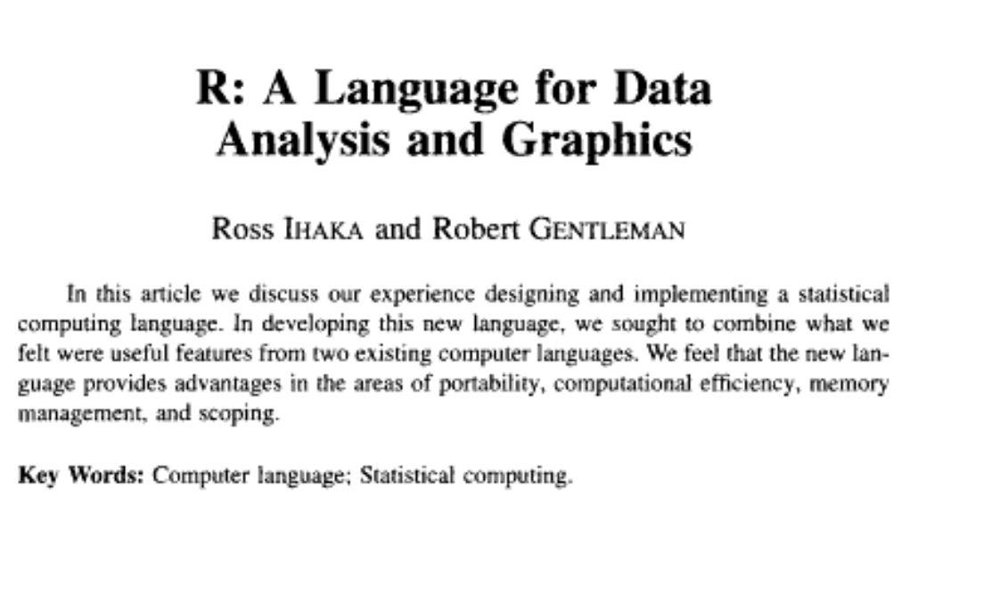
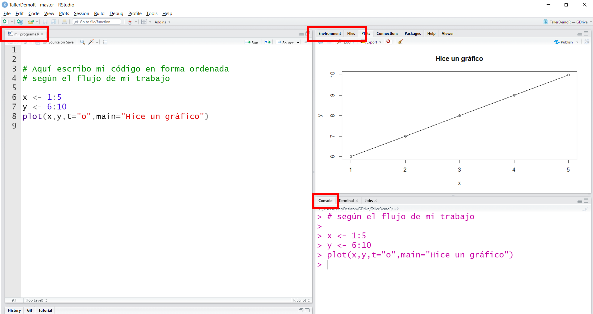
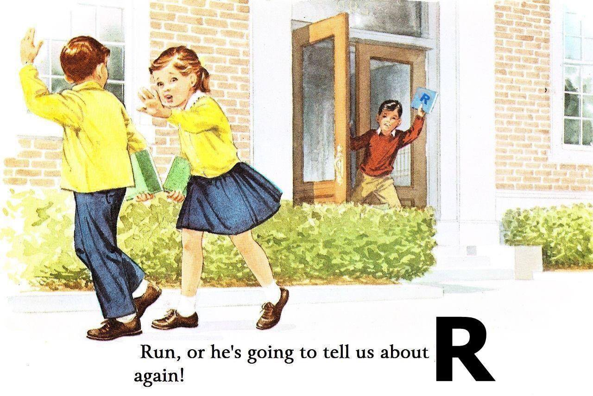
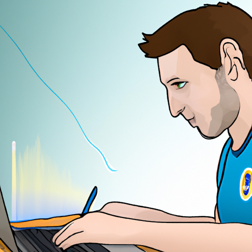
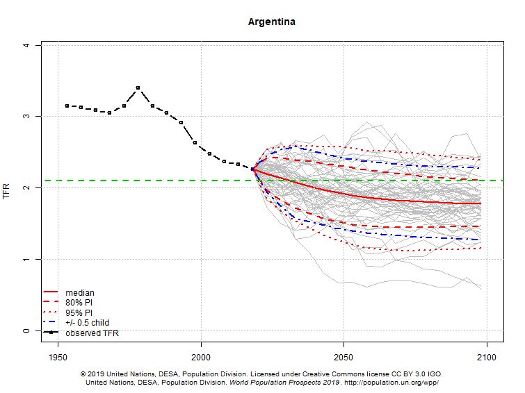
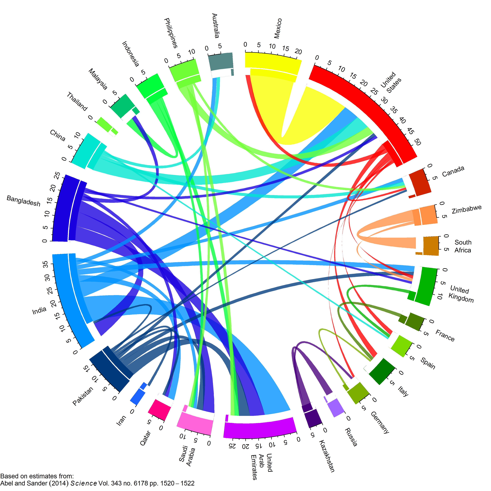

<style>
p.caption {
  font-size: 0.6em;
}
</style>

```{r setup, include=FALSE}
knitr::opts_chunk$set(echo = FALSE, warning = F)
options(htmltools.dir.version = FALSE)
library(calendR)
library(patchwork)
library(knitr)
library(fontawesome)
```

# Este Taller

## ¡Bienvenidos!

--

## Objetivo

  - Dar tus primeros pasos en R
  - Que puedas comenzar tu próximo proyecto de trabajo demográfico en R 

--

Programa el que...

--

```{r, out.width="50%",fig.align='center',fig.cap="https://ivandigital.net/portfolio/carrera-sucia-2019-diciembre/"}
include_graphics("https://ivandigital.net/wp-content/uploads/2021/02/Ivan-Digital-Carrera-Sucia-DIC-2019-0008.jpg")
```

---

# Unidades

.pull-left[
1 - **Introducción y objetos principales**
  - Proyectos + R base + operaciones
  - Un censista que sabe R

2 - **Lectura y manipulación de datos**
  - `dplyr`. Mundo [tidyverse](https://www.tidyverse.org/)
  - Resumen y transformación de datos
  - Un censo en R

3 - **Visualización**
  - `ggplot`
  - Pirámides + Lexis + Mapas
]

--

.pull-right[
4 - **Funciones para el *análisis demográfico***
  - Específicas por componente
  - Pauqetes demográficos

5 - **Reportes dinámicos**
  - *R markdown*: reportes reproducibles en entorno R
]
    
---

# Calendario

```{r, fig.height=7, fig.width=12}
color_days = "#ed9f2b"
weeknames <- c("L","Ma","Mi","J","V","S","D")
nov <- calendR(year = 2023, month = 11,        # Year and month
        start = "M",                   # Start the week on Monday
        text = c("Intro/U1", "U1/U2", # Add text (only for monthly calendars)
                 "U2","U3"), 
        text.pos = c(7,  14, 21, 28),       # Days of the month where to put the texts 
        text.size = 4.5,    
        text.col = 1,
        special.days = c(7,  14, 21, 28),
        special.col = color_days,
        low.col = "white",
        orientation = "l",
        weeknames = weeknames,
        title = "Nov") 
dec <- calendR(year = 2023, month = 12,        # Year and month
        start = "M",                   # Start the week on Monday
        text = c("U4", "U5"), 
        text.pos = c(5, 12),       # Days of the month where to put the texts 
        text.size = 4.5,               # Font size of the text
        text.col = 1,
        special.days = c(5, 12),
        special.col = color_days,
        low.col = "white",
        orientation = "l",
        weeknames = weeknames,
        title = "Dic") 
wrap_plots(nov,dec)
```

Presencial: 7-Nov & 12-Dic

---

# PrepaRándonos

## Estructura

- Clases
  - ~2 horas de recorrido temático, programando a la par
  - ~30 minutos de resolución de ejercicios
- Aprobación del taller: TP final

## Set up inicial    

- `r fa("r-project")` + `r fa("registered")`  instalados  
- Conexión a internet (clases virtuales)  
- Materiales: en general todo en `r fa("github")` [Github](https://github.com/IvanWilli/TallerDemoR). Eventualmente algo de datos pesados en la nube `r fa("google-drive")`.
- `r fa("question")`: para dudas/intercambios utilizaremos [issues](https://github.com/IvanWilli/TallerDemoR/issues) de github. Es necesario registrarse.

---

# R

### ¿Qué es R?

.pull-left[
Definición "oficial":  
"R es un **entorno** de **software** **libre** para computación **estadística** y **gráficos**" (<https://www.r-project.org/>)  

```{r, out.width = "100%"}

```
]

--

.pull-right[

#### Ventajas
- Es libre: mi `r fa("toolbox")`
- Corto *lag* desde inicio a su aplicación.
- Muchos ya han dado el [salto](https://www.amazon.com/SAS-SPSS-Users-Statistics-Computing/dp/1461406846)
- Comunidad:  
    - Colaboración y muuucha información
    - [Conferencias](https://www.r-project.org/conferences/)
    - Cercanas:   
        - [Latin-R](<https://latin-r.com>), [R en Baires](https://www.meetup.com/es/renbaires/), [R-Ladies](https://rladies.org/)  
<!-- - R desde SAS (*PROC_R*), SPSS (Plug-IN *IBM® SPSS® Statistics - Essentials for R*) --> 
- [Visualización](https://www.r-graph-gallery.com/index.html) 

#### Desventajas

- Uso intensivo de memoria
- Más enfocado en Back-end 
]

---

# R Studio

.pull-left[
- Principales tabs:
  - *Console*: donde se ejecuta el código
  - *Source*: donde programo (editor de texto), para luego ejecutar en consola
  - *Environment*: ambiente, radar de objetos creados.
  - *Files*: directorio de archivos a mano
- [Muy personalizable](https://support.rstudio.com/hc/en-us/articles/200549016-Customizing-RStudio).
  "Tools/Global Options":
  - Disposición de tabs
  - Fuente, tamaño, estética...
]

.pull-right[
```{r, out.width = "100%"}

```
Veámoslo en la compu...
]

---

# `r fa("r-project")`  `r fa("exchange-alt")`  `r fa("registered")` 

```{r, out.width="90%",fig.align='center',fig.cap="https://moderndive.com/1-getting-started.html"}
include_graphics("figs/r_vs_rstudio_1.png")
```

---

# En un par de meses...

```{r, fig.height=5,fig.width=17}

```

---

# Paquetes

- Conjunto de **funciones** temáticas. *Encapsular* operaciones y relacionarlas.  
- "Packages are the fundamental units of reproducible R code. They include reusable R functions, the documentation that describes how to use them, and sample data" ([Wickham & Bryan](https://r-pkgs.org/)).
- Se instala solo una vez, luego se activa con `library()` en cada sesión. Por ejemplo:
```{r, echo=T,eval=F}
install.packages("tidyverse")
library(tidyverse)
```

--

- Compartir: "alguien ya resolvió tu problema".
- Requerimientos CRAN (Comprehensive R Archive Network): código + tests + documentación + ayuda.
- Solo en CRAN hay más de 19 mil. [Y creciendo día a día](https://rviews.rstudio.com/)
- La comunidad **legitima** `r fa("users")`.
- Cualquiera puede hacer un paquete; otros usuarios te lo agradecerán (y mejorarán). 

--

- `r fa("robot")`: "..but just like a golem or a modern robot, scientific models are neither true nor false, neither prophets nor charlatans" (McElreath, 2020).

---

# ¿Qué (no) puedo hacer con R?

```{r, echo=T, fig.height=2, fig.width=2}
library(memer)
meme_get("DistractedBf") %>% 
  meme_text_distbf("R", "Demógrafe", "SPSS")
```

---

# ¿Qué (no) puedo hacer con R?

```{r, echo=T, out.width = "50%", fig.align='center'}
library(brickr)
png::readPNG("figs/logoUNLU.png") %>% 
  image_to_mosaic(img_size = 48) %>% 
  build_mosaic()
```

---

# ¿Qué (no) puedo hacer con R?

```{r, echo=T, out.width = "50%", message=F, warning=F, fig.align='center'}
library(ggdogs)
library(ggplot2)
ggplot(data.frame(x = 1:10, y = rnorm(10)), 
       aes(x = x, y = y, dog="husky")) +
       geom_dog(size = 3)+
       geom_smooth()
```

---

# ¿Qué (no) puedo hacer con R?

```{r, echo=T, eval = F}
library(openai)
create_image("Lionel Messi, the Argentinian footbal player, is learning how to use R software to obtain statistics to improve his skills")
```

```{r, echo=F, out.width = "50%", fig.align='center'}

```

---

# `r fa("r-project")` y la Demografía

- [Reproducibilidad](<https://en.wikipedia.org/wiki/Replication_crisis>)
    - Hombros de gigantes  
    - Misma data + código = mismo paper.
    - [Demographic Research](https://www.demographic-research.org/volumes/replicable_articles.htm)
    
```{r, out.width = "80%", fig.align='center', fig.cap="https://www.monicaalexander.com/posts/2019-10-20-reproducibility/"}
include_graphics("figs/flow1.png")
```

---

# `r fa("r-project")` y la Demografía

- Paquetes:
  - [DemoTools](https://timriffe.github.io/DemoTools/)
  - [HMDHFDplus](https://cran.r-project.org/web/packages/HMDHFDplus/HMDHFDplus.pdf)
  - [MortalityLaws](https://cran.r-project.org/web/packages/MortalityLaws/MortalityLaws.pdf)
  - [DemoKin](https://cran.r-project.org/web/packages/DemoKin/index.html)
  - Muchos más...

- Difusión/comunicación de contenido:  
  - [Exceso de Mortalidad](https://mpidr.shinyapps.io/stmortality/)  
  - [Indicadores](https://www.indec.gob.ar/indec/web/Institucional-Indec-IndicadoresDemograficos)
  - [Talleres/Seminarios/presentaciones](https://github.com/ubasellini/IDEM117-AdvancesMortalityForecasting)

---

# Mortalidad

```{r, out.width = "70%", fig.cap="Aburto & otros, 2021", fig.align='center'}
include_graphics("figs/impact_covid.png")
```
---

# Fecundidad

```{r, out.width = "80%", fig.cap="World Population Prospects 2019 Rev.", fig.align='center'}

```

---

# Migración

```{r, out.width = "65%", fig.align='center'}

```

---
class: inverse, center, middle

# ¡Comencemos!

